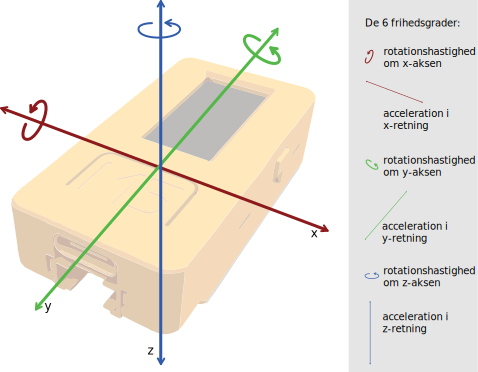
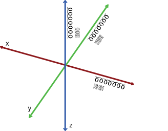
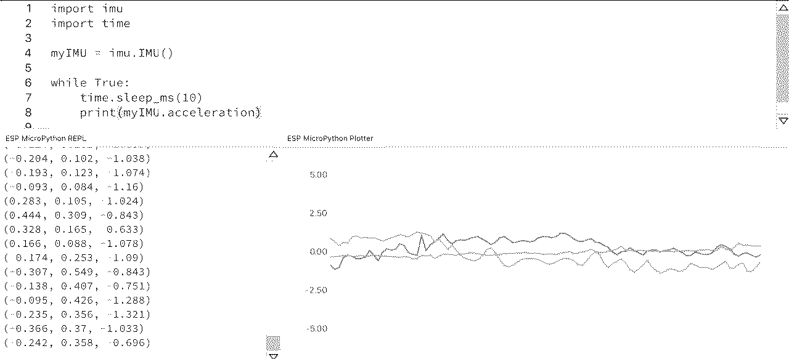
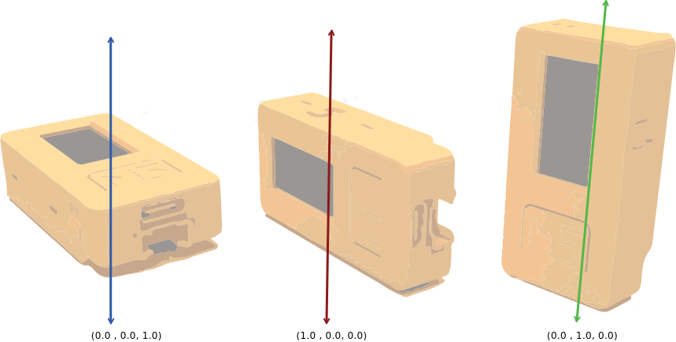
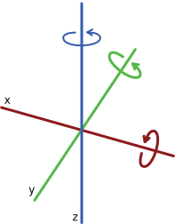
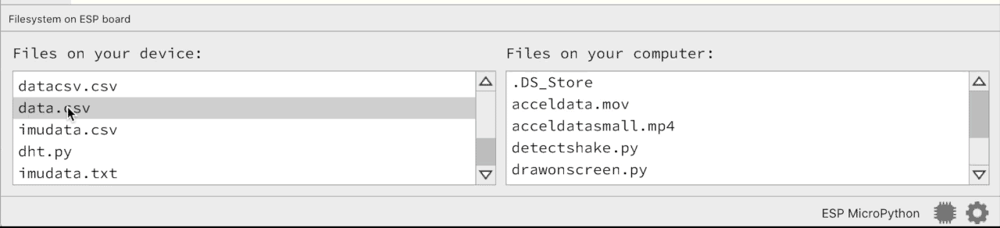
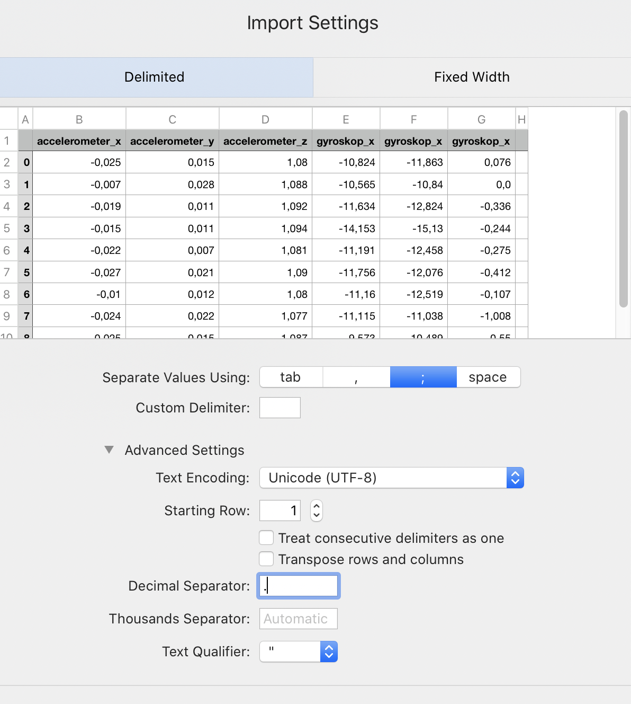

Accelerometer & Gyroskop
========================

Grundlæggende
-------------
M5StickC indeholder en bevægelsessensor, (SH200Q/MPU6886), der består
af et accelerometer og et gyroskop. Bevægelsessensoren kan fx bruges
til at måle:

 * hvor hurtigt man roterer (gyroskop)
 * hvor hurtigt man accelererer eller bremser (accelerometer)
 * tyngdekraften fra jorden, og dermed hvilken retning er nedad (accelerometer)

Bevægelsessensoren er derfor vigtig komponent i fx i biler til at
udløse airbags, i fly til styring. I mobiltelefoner og smart watches
bruges bevægelsessensoren fx til at finde ud af hvilken vej den
vender, eller til den indbyggede skridttæller.

En bevægelsessensor af denne type kaldes en IMU - *inertial
measurement unit*, og den IMU der er indbygget i M5StickC har 6 grader
af frihed.

.. todo:: evt. tilføj labels på figuren med de 6 frihedsgrader?
 * rotationshastighed om x-aksen
 * rotationshastighed om y-aksen
 * rotationshastighed om z-aksen
 * acceleration i x-retning
 * acceleration i y-retning
 * acceleration i z-retning

For at starte med at bruge bevægelsessensoren, skal imu-biblioteket importeres og objektet ``myIMU`` initieres::

	import imu
	
	myIMU = imu.IMU()

           
Accelerometer
^^^^^^^^^^^^^

Accelerometeret registrerer den acceleration hvormed M5StickC bevæges i
retning frem/tilbage eller op/ned langs en akse i tre dimensioner.

Man kan forestille sig at hver akse er forsynet med en lille fjeder
med en vægt, og så måler om fjederen bliver strakt eller trykket
sammen.

Ved hjælp af ``myIMU.acceleration`` kan man hente de rå aflæsninger fra accelerometeret.:: 

   import imu
   import time
   
   myIMU = imu.IMU()

   while True:
   	time.sleep_ms(10)
    	print(myIMU.acceleration)

Klik på **Run** |RUN| og derefter **Plotter** |PLOT| i mu-editoren, for at få vist en graf. Bevæg M5stickC og se at dine bevægelse bliver registreret

Hvis man skal bruge sensorens x y z målinger separeret, kan man gemme dem som enkeltstående variabler::

	ax, ay, az = myIMU.acceleration

Når man holder M5StickC stille med skærmen opad, så vil man kunne måle cirka ``(0.0, 0.0, 1.0)`` Det er tyngdekraften der påvirker z-aksen. Hvis M5StickC drejes som vist på illustrationerne, vil tyngdekræften påvirke henholdsvis x- og y-aksen.  

.. Usikkert om nedenstående skal med og gemmes som kommentar ind til
   videre

   Tyngdekraften vil også påvirke accelerometeret, hvis "fjederen" er
   placeret i op/ned-aksen, men ikke hvis den ligger vandret.

   Enhver flytning af sensoren vil udløse ændringer, men kun mens
   sensoren får ændret sin hastighed - ikke hvis den bevæger sig med jævn
   hastighed eller ligger stille.  Accelerometeret kan altså ikke direkte
   bruges til at måle en placering, men afslører derimod kraften bag en
   bevægelse. Accelerometeret kan i sig selv anvendes til f.eks. at
   registrere ryst.

Gyroskop
^^^^^^^^
Gyroskopet registrerer rotationshastighed omkring en
akse. Rotationshastigheden måles i antal grader per sekund.

Ved at bruge ``myIMU.gyro`` kan man få vist de rå gyroskop data::
	
	import imu
	import time

	myIMU = imu.IMU()

	while True:
    		time.sleep_ms(10)
    		print(myIMU.gyro)
           

Hvis man skal bruge sensorens x y z målinger separeret, kan man gemme dem som enkeltstående variabler::

	gx, gy, gz = myIMU.gyro

Hvis vi for eksempel starter med at holde M5StickC helt stille, så er
Gyroskop aflæsningen ``(0, 0, 0)``, da den ikke roteres. Roterer vi
den langsomt rundt om x aksen, fx med 30 grader hvert sekund, så vil
Gyroskop-aflæsningen give ``(30, 0, 0)``.

Gemme data
----------

.txt fil
^^^^^^^^

For at gemme data laves først en fil, ved at kalde funktionen :func:`open` og give to argumenter. 
Det første argument er det ønskede navn på filen, det næste er \'w\' fordi vi ønsker at kunne skrive i filen (w for write)::

	fil = open('data.txt', 'w')

Dernæst fortæller man hvad der ønsker skrevet i filen med funktionen :func:`fil.write`::
	
	fil.write('Her kan du skrive tekst - husk citationstegn!') 

Tilsidst lukkes filen med :func:`f.close`::
	
	fil.close()

.csv fil
^^^^^^^^

På tilsvarende måde kan man lave en .csv fil. Her kan man bruge komma skifter til næste søjle, mens \'\\n\' (newline) skifter til næste række::

	fil = open('data.csv', 'w')
	fil.write(',søjle1,søjle2,søjle3\n' +
         	  'række1,1,2,3\n' +
         	  'række2,4,5,6\n' +
        	  'række3,7,8,9\n')
	fil.close()

Man skal dog holde tungen lige i munden her - der er en masse tilfælde hvor denne metode vil give et dårligt resultat - og pas på med mellemrum. Python har et indbygget bibliotek til at håndtere csv-filer, med det er desværre ikke med som standart på M5stickC. 
Man kan også importere en .txt fil til de fleste regneark, men hvis man ikke skal lave for meget manuel oprydning, er det en fordel at tænke i de baner som beskrevet herover. 

Hente data
^^^^^^^^^^
Hvis man vil se indholdet af en fil klan det gøres ved at åbne den i læsetilstand med :func:`open` og give \'r\' (r for read) som 2. argument. Dernæst kan funktionen :func:`fil.read` bruges, f.eks sammen med printfunktionen::

	fil = open('data.txt', 'r')
	print(fil.read())
	fil.close()

Fra M5stickC til computer
^^^^^^^^^^^^^^^^^^^^^^^^^
Med :func:`open` og :func:`fil.write` bliver dokumentet gemt lokalt på M5stick'en. For at få den over på computeren, kan man klikke på 'Files' i mu-editoren (husk at lukke REPL og Plotter) og trække den ønskede fil over til \"Files on your computer\". Filen ligger nu samme sted som den mu-fil du arbejder i er gemt.  

EKSEMPEL: Gemme IMU data i .csv format
--------------------------------------

For at få gemt målinger fra bevægelsessensoren kan følgende kode benyttes::

	import imu
	import time

	myIMU = imu.IMU()
	fil = open('imudata.csv', 'w')
	fil.write(';accelerometer_x;accelerometer_y;accelerometer_z;' +
          	'gyroskop_x;gyroskop_x;gyroskop_x\n')

	for i in range(10):	
		time.sleep_ms(600)
  	 	dataline = myIMU.acceleration + myIMU.gyro
  	  	print(dataline)
   	 	fil.write(str(i) + '; ')
  	  	for j in range(len(dataline)):
      	  		fil.write(str(dataline[j]) + '; ')
   	 	fil.write('\n')    
	fil.close() 

Nu kan man trække filen over til computeren og åbne den. 
Tjek at tallene er som de skal være - juster i Import Setting, hvis det ser forkert ud. 
Som delimiter/Value Separator skal semikolon bruges (fordi det er den vi bruger i koden) \';\'. 
Som Decimal Separator skal punktum \'.\' bruges. 
Der er basis for at kludre rigtig meget rundt i tallene - så se dig godt for.    

EKSEMPEL: Registrer bevægelse
-----------------------------

Som illustration på hvordan accelerometeret kan bruges er her eksemplekode:: 

	import imu
	import time
	from m5stack import lcd

	myIMU = imu.IMU()

	def detectAccel(accel, threshold):
       		if abs(accel) > threshold: detectAcceleration = True
		else: detectAcceleration = False
       		return detectAcceleration

	while True:
       		time.sleep_ms(10)
        	print((myIMU.acceleration))
        	if detectAccel(myIMU.acceleration[0], 50):
            		lcd.clear(0xFF0000)
            		time.sleep_ms(1200)
        	if detectAccel(myIMU.acceleration[1], 50):
            		lcd.clear(0x00FF00)
            		time.sleep_ms(1200)
        	if detectAccel(myIMU.acceleration[2], 50):
            		lcd.clear(0x0000FF)
            		time.sleep_ms(1200)
        	else: lcd.clear(0x000000)

