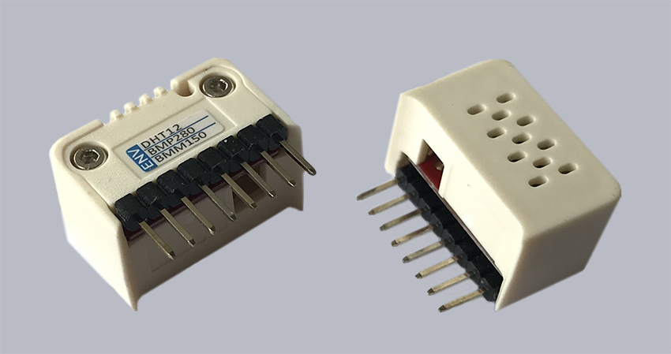

ENV_HAT: Miljøstation
=====================

Tilslut modul
-------------

Det findes nogle faste moduler der kan tilsluttes M5StickC. En af dem er ENV_HAT 

Et lille modul, der, ligesom de andre HAT-moduler, tilsluttes let ved at sætte den 8 pins ind i de 8 huller i toppen af M5StickC.

.. image:: illustrationer/hatmodule.gif

ENV_HAT kan måle luftfugtighed i procent, temperatur i grader celcius og lufttryk i hektopascal::

	from flowlib import hat

	enviroment = hat.get(hat.ENV)

	luftfugtighed = enviroment.humidity
	temperatur = enviroment.temperature
	lufttryk = enviroment.pressure

	print("Luftfugtigheden er: " + str(luftfugtighed) + "%")
	print("Temperaturen er: " + str(temperatur) +"°C" )
	print("Lufttrykket er: "+ str(lufttryk)+ " hPa")

EKSEMPEl: aflæs ENV-sensor med knaptryk
---------------------------------------

Tag M5stickC med på tur og aflæs luftfugtighed, temperatur og lufttryk på skærmen::

	from flowlib import hat
	from m5stack import lcd
	from m5stack import btnA

	envi = hat.get(hat.ENV)
	count = 0
	lcd.clear(0x000000)
	lcd.text(0,10, "ENV_HAT sensor.")
	lcd.font(lcd.FONT_DefaultSmall)
	lcd.text(0,40, "Tryk på knappen.")
	
	while True:
	   if btnA.wasPressed():
	      lcd.clear(0x000000)
	      lcd.font(lcd.FONT_DefaultSmall)
	      count += 1
	      if (count > 2):
	         count = 0
	      if (count == 0):
	         hum = envi.humidity
	         textoutput = str(hum) +"%"
	         lcd.text(0,10, "Luftfugtighed")
	         lcd.text(5,50, textoutput)
	      if (count == 1):
	         tem = envi.temperature
	         textoutput = str(tem) + " C"
	         lcd.text(0,10, "Temperatur")
	         lcd.text(5,50, textoutput)
	      if (count == 2):
	         tryk = envi.pressure
	         textoutput = str(tryk) +" hPa"
	         lcd.text(0,10, "Lufttryk")
	         lcd.text(5,50, textoutput)

