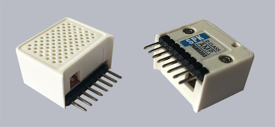
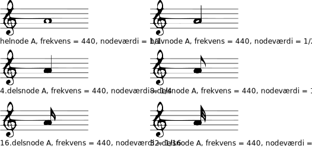

SPK_HAT: Speaker
================

Tilslut modul
-------------

Det findes nogle faste moduler der kan tilsluttes M5StickC. En af dem er SPK_HAT 

En lille speaker, der, ligesom de andre HAT-moduler, tilsluttes let ved at sætte den 8 pins ind i de 8 huller i toppen af M5StickC.

.. image:: illustrationer/hatmodule.gif

Afspil toner
------------
For at lave et musikstykke, har vi brug for at kende frekvensen/*tonens høje* samt nodeværdien/*tonens varighed*, for de toner vi skal bruge,. Frekvensen kan beregnes - eller du kan finde en liste i bunden af denne side :ref:`frek`. Kammertonen **A** har frekvens 440. 

SPK-modulet er begrænset til at spille 1 tone af gangen, hvilket selvfølgelig lægger lidt en dæmper på de musikalske udfoldelser. 

M5StickC har to funktioner i biblioteket til at lave lyde; :func:`sing` og :func:`tone`. 

:func:`sing` skal bruges ved at give frekvensen og derefter nodeværdien. 
::
	spk.sing(440, (1/4)*4)

*Jeg ganger nodeværdien med 4, i mit eksempel fordi jeg synes den afspiller for hurtigt ellers* 

:func:`tone` skal bruges ved at give frekvensen og derefter en varighed i millisekunder. 
::
	spk.tone(440, 1500)

EKSEMPEL: De første toner
------------------------------------
::

	from m5stack import lcd
	import time
	from flowlib import hat

	spk = hat.get(hat.SPEAKER)
	
	# Giv frekvensen navn efter tonerne
	C7 = 2093
	G6 = 1568
	E6 = 1319
	A6 = 1760
	AS6 = 1865
	B6 = 1976
	
	spk.tone(C7,500)
	time.sleep_ms(200)
	spk.tone(G6,500)
	time.sleep_ms(200)
	spk.tone(E6,500)
	time.sleep_ms(200)
	spk.tone(A6,500)
	time.sleep_ms(100)
	spk.tone(B6,250)
	time.sleep_ms(50)
	spk.tone(AS6,250)
	time.sleep_ms(100)
	spk.tone(A6,500)

EKSEMPEL: Spil Megalovania
------------------------------------
::
	
	from flowlib import hat
	import time

	spk = hat.get(hat.SPEAKER)

	# De 22 toner der skal bruges:
	N_AS2 = 117
	N_B2 = 123
	N_C3 = 131
	N_D3 = 147
	N_F3 = 175
	N_G3 = 196
	N_GS3 = 208
	N_A3 = 220
	N_AS3 = 233
	N_B3 = 247
	N_C4 = 262
	N_CS4 = 277
	N_D4 = 294
	N_DS4 = 311
	N_E4 = 330
	N_F4 = 349
	N_G4 = 392
	N_GS4 = 415
	N_A4 = 440
	N_C5 = 523
	N_CS5 = 554
	N_D5 = 587
	
	melodi = [N_D3, N_D3, N_D4, N_A3, N_GS3, N_G3, N_F3, N_D3,
  		 N_F3, N_G3, N_C3, N_C3, N_D4, N_A3, N_GS3, N_G3,
		 N_F3, N_D3, N_F3, N_G3, N_B2, N_B2, N_D4, N_A3,
       		 N_GS3, N_G3, N_F3, N_D3, N_F3, N_G3, N_AS2, N_AS2,
 		 N_D4, N_A3, N_GS3, N_G3, N_F3, N_D3, N_F3, N_G3,
		 N_D3, N_D3, N_D4, N_A3, N_GS3, N_G3, N_F3, N_D3,
		 N_F3, N_G3, N_C3, N_C3, N_D4, N_A3, N_GS3, N_G3,
		 N_F3, N_D3, N_F3, N_G3, N_B2, N_B2, N_D4, N_A3,
  		 N_GS3, N_G3, N_F3, N_D3, N_F3, N_G3, N_AS2, N_AS2,
		 N_D4, N_A3, N_GS3, N_G3, N_F3, N_D3, N_F3, N_G3,
      		 N_D4, N_D4, N_D5, N_A4, N_GS4, N_G4, N_F4, N_D4,
		 N_F4, N_G4, N_C4, N_C4, N_D5, N_A4, N_GS4, N_G4,
		 N_F4, N_D4, N_F4, N_G4, N_B3, N_B3, N_D5, N_A4,
      		 N_GS4, N_G4, N_F4, N_D4, N_F4, N_G4, N_AS3, N_AS3,
      		 N_D5, N_A4, N_GS4, N_G4, N_F4, N_D4, N_F4, N_G4,
      		 N_D4, N_D4, N_D5, N_A4, N_GS4, N_G4, N_F4, N_D4,
      		 N_F4, N_G4, N_C4, N_C4, N_D5, N_A4, N_GS4, N_G4,
      		 N_F4, N_D4, N_F4, N_G4, N_B3, N_B3, N_D5, N_A4,
            	 N_GS4, N_G4, N_F4, N_D4, N_F4, N_G4, N_AS3, N_AS3,
          	 N_D5, N_A4, N_GS4, N_G4, N_F4, N_D4, N_F4, N_G4,
          	 N_F4, N_F4, N_F4, N_F4, N_F4, N_D4, N_D4, N_D4, N_F4,
          	 N_F4, N_F4, N_G4, N_GS4, N_G4, N_F4, N_D4, N_F4, N_G4,
         	 N_F4, N_F4, N_F4, N_G4, N_GS4, N_A4, N_C5, N_A4,
          	 N_D5, N_D5, N_D5, N_A4, N_D5, N_C5, N_F4, N_F4, N_F4,
          	 N_F4, N_F4, N_D4, N_D4, N_D4, N_F4, N_F4, N_F4, N_F4,
          	 N_D4, N_F4, N_E4, N_D4, N_C4, N_G4, N_E4, N_D4,
          	 N_D4, N_D4, N_D4, N_F3, N_G3, N_AS3, N_C4, N_D4,
          	 N_F4, N_C5, N_F4, N_D4, N_F4, N_G4, N_GS4, N_G4,
          	 N_F4, N_D4, N_GS4, N_G4, N_F4, N_D4, N_F4, N_F4, N_F4,
          	 N_GS4, N_A4, N_C5, N_A4, N_GS4, N_G4, N_F4, N_D4, N_E4,
          	 N_F4, N_G4, N_A4, N_C5, N_CS5, N_GS4, N_GS4, N_G4,
          	 N_F4, N_G4, N_F3, N_G3, N_A3, N_F4, N_E4, N_D4,
          	 N_E4, N_F4, N_G4, N_E4, N_A4, N_A4, N_G4, N_F4,
          	 N_DS4, N_CS4, N_DS4, N_F4, N_D4, N_F4, N_G4,
          	 N_GS4, N_G4, N_F4, N_D4, N_GS4, N_G4, N_F4, N_D4,
          	 N_F4, N_F4, N_F4, N_GS4, N_A4, N_C5, N_A4, N_GS4,
          	 N_G4, N_F4, N_D4, N_E4, N_F4, N_G4, N_A4, N_C5,
          	 N_CS5, N_GS4, N_GS4, N_G4, N_F4, N_G4, N_F3, N_G3,
          	 N_A3, N_F4, N_E4, N_D4, N_E4, N_F4, N_G4, N_E4, N_A4,
          	 N_A4, N_G4, N_F4, N_DS4, N_CS4, N_DS4, ]

	varighed = [16, 16, 8, 6, 8, 8, 8, 16, 16, 16, 16, 16,
	            8, 6, 8, 8, 8, 16, 16, 16, 16, 16, 8, 6,
	            8, 8, 8, 16, 16, 16, 16, 16, 8, 6, 8, 8, 8,
	            16, 16, 16, 16, 16, 8, 6, 8, 8, 8, 16, 16, 16,
	            16, 16, 8, 6, 8, 8, 8, 16, 16, 16, 16, 16, 8,
	            6, 8, 8, 8, 16, 16, 16, 16, 16, 8, 6, 8,
	            8, 8, 16, 16, 16, 16, 16, 8, 6, 8, 8, 8, 16,
	            16, 16, 16, 16, 8, 6, 8, 8, 8, 16, 16, 16, 16,
	            16, 8, 6, 8, 8, 8, 16, 16, 16, 16, 16, 8, 6,
	            8, 8, 8, 16, 16, 16, 16, 16, 8, 6, 8, 8, 8, 16,
	            16, 16, 16, 16, 8, 6, 8, 8, 8, 16, 16, 16, 16,
	            16, 8, 6, 8, 8, 8, 16, 16, 16, 16, 16, 8, 6,
	            8, 8, 8, 16, 16, 16, 8, 16, 8, 8, 8, 8, 4, 16, 8, 16,
	            8, 8, 8, 16, 16, 16, 16, 16, 8, 8, 16, 8, 8, 8, 8, 8,
	            8, 8, 8, 16, 16, 16, 2, 8, 16, 8, 8, 8, 8, 4, 16, 8,
	            16, 8, 8, 8, 8, 8, 16, 8, 16, 8, 8, 8, 8, 8, 8, 8, 16,
	            8, 16, 8, 8, 2, 3, 16, 16, 16, 16, 16, 16, 16, 16, 16,
	            16, 16, 16, 8, 2, 16, 8, 16, 8, 16, 16, 16, 16, 16, 16,
	            8, 8, 8, 8,  8, 8, 16, 16, 16, 2, 8, 8, 8, 8, 4, 4, 4,
	            4, 4, 4, 2, 8, 8, 8, 8, 2, 2, 3, 16, 16, 16, 16, 16,
	            16, 16, 16, 16, 16, 16, 16, 8, 2, 16, 8, 16, 8, 16, 16,
	            16, 16, 16, 16, 8, 8, 8, 8,  8, 8, 16, 16, 16, 2, 8, 8,
	            8, 8, 4, 4, 4, 4, 4, 4, 2, 8, 8, 8, 8, 2, 1,]

	tilpasVarighed = [(1/element)*4 for element in varighed]

	for i in range(len(melodi)):
    		spk.sing(melodi[i], tilpasVarighed[i])
    		time.sleep_ms(10)

EKSEMPEL: Registrer bevægelse med lyd
-------------------------------------

Afspilning af tone når armen løftes::

	from lib import imu 
	from m5stack import lcd 
	# Importer bibliotek til at arbejde med højttaler
	from flowlib import hat
	import time 

	myIMU = imu.IMU() 

	ax, ay, az = myIMU.acceleration 
	ay_sidst = ay 
	hastighed = 0.025 

	hat_spk0 = hat.get(hat.SPEAKER)
	tone = 1500

	while True: 
		ax, ay, az = myIMU.acceleration 
		if ay > ay_sidst: 
			#For at få lyd ud af højtaleren beder vi den om at "synge"
			hat_spk0.sing(tone, 0.33)
			#Tone bliver højere, jo længere tid vi laver den rigtige bevægelse
			tone += 100
			#denne linje sætter en baggrundsfarve på M5StickC
			lcd.clear(0x75ad0a)

		else: 
			#her sætter vi tone tilbage til udgangspunktet
			tone = 1500
			#denne linje sætter en baggrundsfarve på M5StickC
			lcd.clear(0xffff99)

		ay_sidst = ay+hastighed 
		time.sleep_ms(300)

.. _frek:

Oversigt over Frekvenser
^^^^^^^^^^^^^^^^^^^^^^^^
::

	N_B0  = 31
	N_C1  = 33
	N_CS1 = 35
	N_D1  = 37
	N_DS1 = 39
	N_E1  = 41
	N_F1  = 44	
	N_FS1 = 46
	N_G1  = 49
	N_GS1 = 52
	N_A1  = 55
	N_AS1 = 58
	N_B1  = 62
	N_C2  = 65
	N_CS2 = 69
	N_D2  = 73
	N_DS2 = 78
	N_E2  = 82
	N_F2  = 87
	N_FS2 = 93
	N_G2  = 98
	N_GS2 = 104
	N_A2  = 110
	N_AS2 = 117
	N_B2  = 123
	N_C3  = 131
	N_CS3 = 139
	N_D3  = 147
	N_DS3 = 156
	N_E3  = 165
	N_F3  = 175
	N_FS3 = 185
	N_G3  = 196
	N_GS3 = 208
	N_A3  = 220
	N_AS3 = 233
	N_B3  = 247
	N_C4  = 262
	N_CS4 = 277
	N_D4  = 294
	N_DS4 = 311
	N_E4  = 330
	N_F4  = 349
	N_FS4 = 370
	N_G4  = 392
	N_GS4 = 415
	N_A4  = 440
	N_AS4 = 466
	N_B4  = 494
	N_C5  = 523
	N_CS5 = 554
	N_D5  = 587
	N_DS5 = 622
	N_E5  = 659
	N_F5  = 698
	N_FS5 = 740
	N_G5  = 784
	N_GS5 = 831
	N_A5  = 880
	N_AS5 = 932
	N_B5  = 988
	N_C6  = 1047
	N_CS6 = 1109
	N_D6  = 1175
	N_DS6 = 1245
	N_E6  = 1319
	N_F6  = 1397
	N_FS6 = 1480
	N_G6  = 1568
	N_GS6 = 1661
	N_A6  = 1760
	N_AS6 = 1865
	N_B6  = 1976
	N_C7  = 2093
	N_CS7 = 2217
	N_D7  = 2349
	N_DS7 = 2489
	N_E7  = 2637
	N_F7  = 2794
	N_FS7 = 2960
	N_G7  = 3136
	N_GS7 = 3322
	N_A7  = 3520
	N_AS7 = 3729
	N_B7  = 3951
	N_C8  = 4186
	N_CS8 = 4435
	N_D8  = 4699
	N_DS8 = 4978
