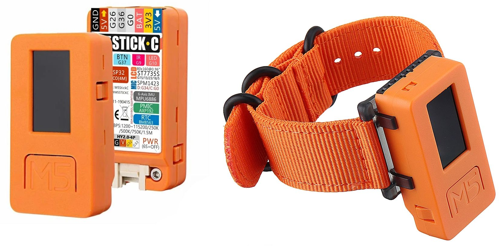

M5 MicroPython Guide
====================

Velkommen til denne uofficielle guide til M5 MicroPython på
M5StickC. Denne guide er tænkt både som en introduktion for nye
brugere, og som generel dokumentation af de forskellige biblioteker
nødvendige for at programmere en M5StickC.

**Status:** *Guiden er pt. under udvikling. Den nuværende ambition er
at dække de primære områder, så som: tegne på skærmen, bruge af
indbyggede sensorer, og eksempler på hvordan eksterne enheder kobles
på. I fremtiden kan det være andre emner også bliver dækket.*

Første skridt
-------------
.. toctree::
   :maxdepth: 1

   komigang
   tekniskespec
   onebuttonwearable
   shortyshower

Brugerguide
-----------
.. toctree::
   :maxdepth: 2

   tegne
   accelerometer_gyro
   wifi
   tid
   stroem
   sensorfusion

Videre med M5StickC og Python
-----------------------------
 * FAQ
 * Projektidéer
 * Tutorials/bøger om Python

Avanceret
---------
 * Tilkoble kamera (M5 UnitV)
 * `boot.py`
 * ESP32 Thing og flash MicroPython firmware
 * Loddeguide

..
   User guide
   ----------
    * Drawing on the LCD screen
    * Built-in buttons
    * Built-in LED
    * Accelerometer and gyroscope
    * Connectivity

      * WiFI
      * ESPNOW
    * Time
    * Microphone
    * External devices

      * SPK-HAT: Speaker
      * ENV-HAT: Environmental sensor

   With additional libraries
   -------------------------
    * Sensor fusion: calculating `pitch` and `roll`

Leder du efter noget specifikt?
-------------------------------
* :ref:`Søgning <search>` - søg i hele dokumentationen

* :ref:`genindex` - register over alle kommandoer

.. * :ref:`modindex`

