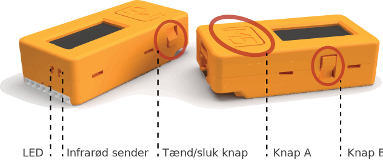
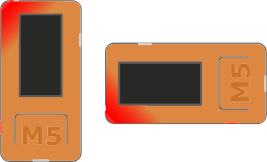

Knaptryk og indbygget LED
=========================
M5StickC har to knapper vi kan programmere. Den under skærmen kaldes
knap A, og den på højre side kaldes knap B. Den sidste knap på venstre
side bruges til at tænde og slukke M5StickC

Tænd/sluk knap
--------------
For at tænde trykkes en enkelt gang på knappen. For at resette trykkes en enkelt gang. For at slukke helt holdes knappen inde i 5 sekunder (indtil den slukker).

.. _indbygget_led:

Indbygget LED
-----------------------
I det ene hjørne har din M5StickC en indbygget LED-lampe man kan tænde
og slukke. For at tænde den kan du skrive følgende::

  from m5stack import M5Led
  M5Led.on()

Sluk for LED'en ved at ændre i koden så der står::

   M5Led.off()

Her er et simpelt program der igen og igen blinker med LED'en::

  from m5stack import M5Led
  import time

  while True:
    M5Led.on()
    time.sleep_ms(500)
    M5Led.off()
    time.sleep_ms(500)

Linjen ``while True:`` gentager de efterfølgende linjer igen og igen,
uendeligt.

Kommandoen ``time.sleep_ms(500)`` fra modulet ``time``, pauser
programmet i et antal millisekunder, i dette tilfælde et halvt sekund,
500 millisekunder.
    
.. _knaptryk:

Registrere knaptryk
-------------------
For at registrere knaptryk på knap A, skal vi bruge følgende
kode. Prøv at tast det ind::

  from m5stack import btnA

  while True:
    if btnA.wasPressed():
      print("Hello")

Prøv at køre programmet og tryk på knappen.

Linjerne kan forstås sådan her:

* Den første linje importerer ``btnA``.
  
* Linjen ``while True:`` fortæller at de næste linjer skal gentages
  igen og igen uendeligt - vi vil blive ved med at holde øje med
  knaptryk.

* Linjen ``if btnA.wasPressed():`` tjekker om der er blevet trykket på knap A.

* Linjen ``print("Hello")`` viser teksten "Hello" (ikke på M5StickC's
  skærm, men i Mu-editoren)

I stedet for bare at skrive ``Hello`` på skærmen, kan vi prøve at ændre
en variabel og tælle hvor mange gange der er trykket på knappen.

Tælle knaptryk
--------------
Prøv at ændre i programmet, så det kommer til at se sådan her ud::

  from m5stack import btnA
  
  count = 0

  while True:
    if btnA.wasPressed():
      count = count + 1
      print(count)

Her opretter vi først en tællervariabel ``count``, som starter
ved 0. Derefter gør vi så hver gang man trykker på knap A, lægges
der én til den variabel og værdien vises med ``print(count)``.
