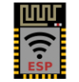
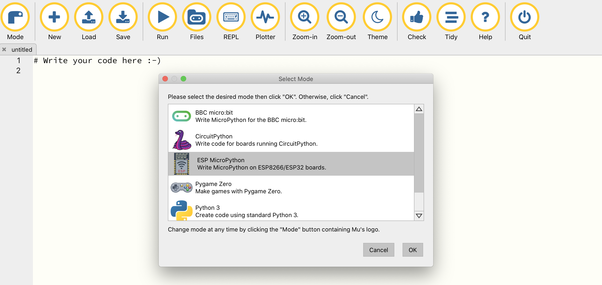
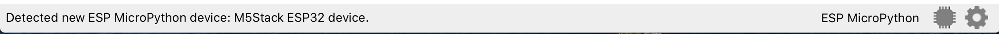
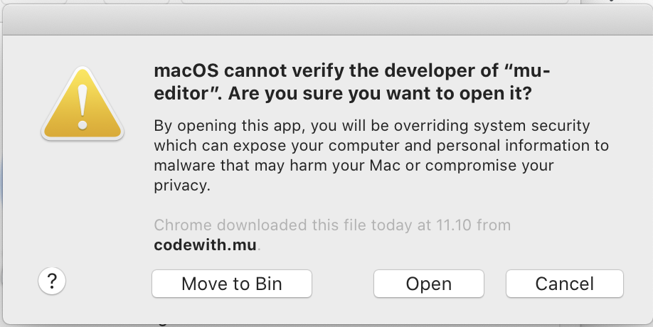

.. |RUN| image:: illustrationer/mubilleder/run.jpg
   :height: 20
   :width: 20

Kom godt igang
==============
Der findes forskellige måder at programmere sin M5StickC på. I denne
guide bruger vi Mu-editoren.

.. todo:: video der gennemgår samme trin som denne guide

Installation af Mu-editoren
---------------------------

Hent og installér denne alpha-udgave af Mu-editoren, som understøtter M5StickC:

- `Hent Mu-editor til Windows (64 bit) <https://s3-eu-west-2.amazonaws.com/mu-builds/windows/mu_2020-10-23_13_42_master_3083c77_64bit.exe>`_
- `Hent Mu-editor til Mac OS X <https://s3-eu-west-2.amazonaws.com/mu-builds/osx/mu-editor_2020-10-08_22_06_master_e6adf68.zip>`_
- `Hent Mu-editor til Linux <https://s3-eu-west-2.amazonaws.com/mu-builds/linux/mu_2018-06-12_14_00_master_11bdd93.bin>`_

Næste version af Mu har indbygget support for M5StickC, og udgives
omkring januar 2021. Hvis du installerer Mu-editoren fra deres hjemmeside,
vil Mu ikke fungere ordentligt sammen med M5StickC.

..
   Følg instrukserne og download Mu-editoren her:
   https://codewith.mu/en/download Det er vigtigt at downloade Alpha
   versionen for at kunne arbejde med M5StickC.

   .. figure:: illustrationer/mubilleder/downloadMU.jpg
      :alt: MU download skærm
      :width: 500px

Start Mu
--------
Første gang Mu åbner bliver du bedt om at vælge en *mode* i dialogen
**Select Mode**.  Her skal du vælge |ESP| **ESP MicroPython** for at
arbejde med M5StickC. Du kan altid vælge en anden *mode* ved at klikke
øverst til venstre |MODE|

Har du problemer med at åbne Mu på Mac? Læs :ref:`fejlsøgningsguiden i
bunden af denne side <troubleshooting_guide>`

M5StickC
--------

Når Mu er downloaded og startet tilsluttes M5StickC til computerne via
det medfølgende USB-C kabel. Mu skulle gerne selv finde M5StickC og du
vil se følgende besked i bunden af vinduet:

Hvis du har dette symbol nederst i højre hjørne |NOTCONNECTED| er din
M5StickC ikke tilsluttet. Prøv eventuelt at koble den til og fra,
eller bruge en anden USB-port. Hvis det stadig ikke virker, så læs
:ref:`fejlsøgningsguiden nedenfor <troubleshooting_guide>`.

Har du problemer med forbindelsen til M5StickC? Læs :ref:`sektionen i bunden af
denne side <mu-on-mac-issues>`

Dit første program til M5StickC
^^^^^^^^^^^^^^^^^^^^^^^^^^^^^^^
Du er nu klar til at skrive din første kode. Du placere cursoren der
hvor der står ``# Write your code here :-)`` og skriver følgende::

   # Importer inbygget bibliotek for at arbejde med skærmen
   from m5stack import lcd
   
   # Skriver første linje
   lcd.text(10, 10, "Hello")
   # Skriver næste linje
   lcd.text(10, 25, "World!")

Hvis du starter en linje med ``#`` bliver det forstået som en
kommentar til koden, og får ikke betydning for dit program. Det kan
være smart at skrive kommentarer undervejs, så man altid senere kan
huske hvorfor man skrev som man gjorde. Når du har skrevet ovenstående
i Mu så klik på Run |RUN| og du skulle nu kunne se noget skrift på
M5StickCs lcd skærm.

   .. figure:: illustrationer/texthelloworld.svg
      :alt: tekst "Hello!"
      :width: 500px
     

Tillykke du er nu godt igang! 

Hvis du vil vide mere om Mu-editoren, så har holdet bag Mu-editoren
har en række tutorials, der kan gøre dig fortrolig med hvordan Mu
fungere, de er på engelsk og du finder dem her:
https://codewith.mu/en/tutorials/

.. _troubleshooting_guide:

Fejlsøgningsguide
-----------------

Der er nogle gange problemer med at få Mu og M5StickC til at snakke
sammen. Her er en oversigt over de mest almindelige problemer, og hvad
der måske kan løse det.

.. _mu-on-mac-issues:

Problemer med at åbne Mu på Mac?
^^^^^^^^^^^^^^^^^^^^^^^^^^^^^^^^
.. figure:: illustrationer/mubilleder/muMacOpen1.png
   :alt: open
   :width: 500px

Hvis du er Mac-bruger og ser en besked om, at programmet ikke kan
åbnes, fordi det stammer fra en ukendt udvikler eller ikke blev hentet
fra App Store, skal du gøre følgende:

	* Finde programmet i *Finder*. 
	* Holde *control* nede og klikke - eller højreklikke, hvis du har mus tilsluttet. 
	* Der dukker nu en menu frem og øverst kan du vælge *open*. 
	* Der vil nu dukke et vindue op, hvor du igen vælger *open*
	* Fremover vil programmet åbne, som alle andre programmer. 

M5StickC bliver ikke opdaget af Mu (Windows)
^^^^^^^^^^^^^^^^^^^^^^^^^^^^^^^^^^^^^^^^^^^^

Hvis du bruger Windows og M5StickC ikke bliver opdaget af Mu-editoren,
kan det være fordi Windows ikke automatisk har kunne installere de
nødvendige drivers.

Normalt finder Windows selv de nødvendige drivers og downloader dem,
men det kræver at din computer er på internettet når du sætter
USB-kablet til M5StickC i computeren.

Det nemmeste er manuelt at installere driverne, som kan downloades her:
http://www.ftdichip.com/Drivers/CDM/CDM21228_Setup.zip

M5StickC bliver ikke opdaget af Mu (Mac)
^^^^^^^^^^^^^^^^^^^^^^^^^^^^^^^^^^^^^^^^
          
Hvis du har dette symbol nederst i højre hjørne |NOTCONNECTED| er din
M5StickC ikke tilsluttet. Prøv at genstarte MU. Hvis det ikke virker,
så prøv at genstarte hele computeren. Stadig problemer? Prøv at
tilslutte M5Stick til en anden USB port og genstart. Hvis du arbejder
på Macbook, og ingen af dine USB porte ser ud til at virke, kan du
prøve at resette SMC'en - følg denne guide
https://macpaw.com/how-to/fix-usb-ports-on-mac. Hold M5Stick
tilsluttet mens du resetter.

.. todo:: link til Mac USB-driver, som i meget sjældne tilfælde er
          nødvendig (Martin graver det frem)

Har du stadig problemer?
^^^^^^^^^^^^^^^^^^^^^^^^

Prøv at beskriv dit problem på følgende chat-kanal for Mu-editoren (på
engelsk): https://gitter.im/mu-editor/general (kræver Github eller
Twitter konto for at logge på).
