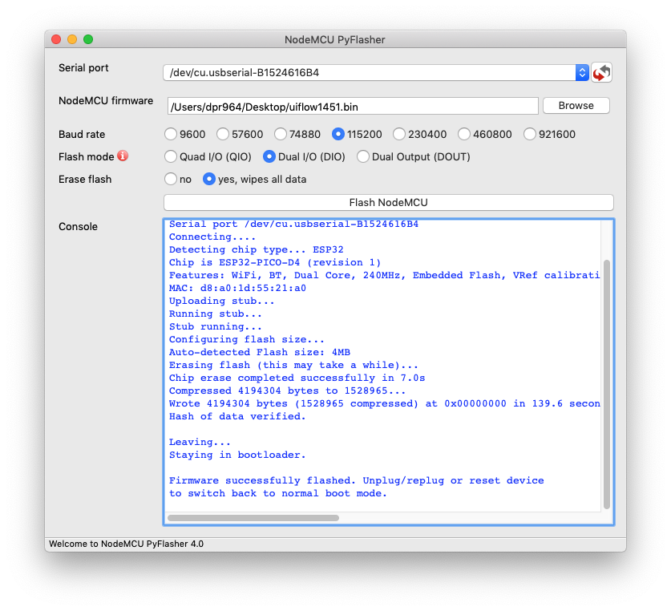
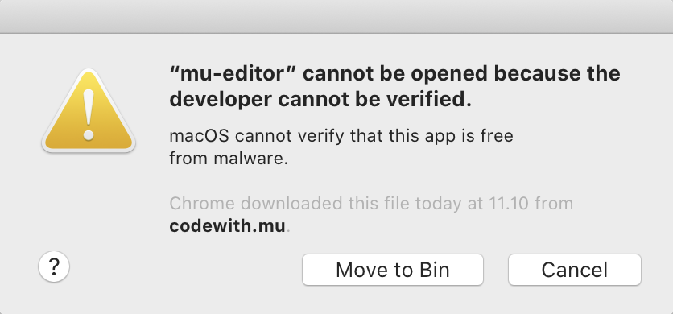

.. |MODE| image:: illustrationer/mubilleder/mode.jpg
   :height: 20
   :width: 20

.. |ESP| image:: illustrationer/mubilleder/esp.jpg
   :height: 20
   :width: 20

.. |RUN| image:: illustrationer/mubilleder/run.jpg
   :height: 20
   :width: 20

.. |NOTCONNECTED| image:: illustrationer/mubilleder/notconnected.jpg
   :height: 20
   :width: 20

Kom godt igang
==============
Der findes forskellige måder at programmere sin M5StickC på. I denne
guide bruger vi MicroPython og Mu-editoren. Man kan også programmere
den med Arduino, men så skal man søge dokumentation andet steds fra.

Videoguide
----------

Videoen her forklarer Maja alle trinene i guiden. Har du problemer, så
finder du en :ref:`troubleshooting_guide` nederst på denne side.

.. raw:: html

         <iframe width="560" height="315" src="https://www.youtube.com/embed/cD4QTLzDrwQ" frameborder="0" allow="accelerometer; autoplay; clipboard-write; encrypted-media; gyroscope; picture-in-picture" allowfullscreen></iframe>
         

MicroPython firmware på M5StickC
--------------------------------
MicroPython er en version af Python 3 der kan køre på
microcontrollers, som den i M5StickC. Desværre ligger MicroPython ikke
altid på M5StickC, når man køber dem.

Her er en guide til at lægge nyeste version af deres
MicroPython firmware på:

**Hent og installer NodeMCU-PyFlasher:**

1. Download `NodeMCU-PyFlasher <https://github.com/marcelstoer/nodemcu-pyflasher/releases/tag/v4.0>`_: `Windows (64 bit) <https://github.com/marcelstoer/nodemcu-pyflasher/releases/download/v4.0/NodeMCU-PyFlasher-4.0-x64.exe>`_ - `Mac OS X <https://github.com/marcelstoer/nodemcu-pyflasher/releases/download/v4.0/NodeMCU-PyFlasher-4.0.dmg>`_
2. Installer NodeMCU-PyFlasher
3. Åbn NodeMCU-PyFlasher (på Mac: højreklik og Åbn)

**Overfør firmware**

1. Download M5Stack MicroPython firmware: :download:`micropython_w_m5stackaddons.bin <_static/micropython_w_m5stackaddons.bin>`
2. Tilslut din M5StickC
3. Vælg seriel-port øverst (på Windows fx COM2, på Mac fx /dev/cu.usbserial-B1524616B4)
4. Tryk browse og vælg firmwaren du har downloadet
5. Vælg "Yes, wipes all data"
6. Tryk "Flash NodeMCU"
7. Vent til der står *"Firmware successfully flashed. Unplug/replug or reset device
   to switch back to normal boot mode."*
8. Genstart din M5StickC: hold knappen på siden inde i 6 sekunder -
   den knap tættest på USB-kablet

..
   1. Download M5Burner fra: https://m5stack.com/pages/download
   2. Installer M5Burner (på Mac *skal* den flyttes til Applications-folderen)
   3. Tilslut uret - og vælg den rette COM/seriel-port øverst til venstre
   4. Slet den eksisterende firmware ved at trykke på den grønne "Erase"-knap yderst til højre
   5. Tryk STICKC yderst til højre - og Download den første mulighed (UIFlow_StickC, v1.6.6)

Installation af Mu-editoren
---------------------------
Hent og installér denne alpha-udgave af Mu-editoren, som understøtter M5StickC:

- `Hent Mu-editor til Windows (64 bit) <https://s3-eu-west-2.amazonaws.com/mu-builds/windows/mu_2020-10-23_13_42_master_3083c77_64bit.exe>`_
- `Hent Mu-editor til Mac OS X <https://s3-eu-west-2.amazonaws.com/mu-builds/osx/mu-editor_2020-10-08_22_06_master_e6adf68.zip>`_
- `Hent Mu-editor til Linux <https://s3-eu-west-2.amazonaws.com/mu-builds/linux/mu_2018-06-12_14_00_master_11bdd93.bin>`_

.. warning:: Nyeste udgave af Mu fra deres hjemmeside, understøtter
             ikke M5StickC endnu. Derfor er det vigtigt du henter Mu
             via linkene ovenfor.

Næste version af Mu har indbygget support for M5StickC, og udgives
i starten af 2021. Hvis du installerer Mu-editoren fra deres hjemmeside,
vil Mu ikke fungere ordentligt sammen med M5StickC.

..
   Følg instrukserne og download Mu-editoren her:
   https://codewith.mu/en/download Det er vigtigt at downloade Alpha
   versionen for at kunne arbejde med M5StickC.

   .. figure:: illustrationer/mubilleder/downloadMU.jpg
      :alt: Mu download skærm
      :width: 500px

Start Mu
--------
Første gang Mu åbner bliver du bedt om at vælge en *mode* i dialogen
**Select Mode**.  Her skal du vælge |ESP| **ESP MicroPython** for at
arbejde med M5StickC. Du kan altid vælge en anden *mode* ved at klikke
øverst til venstre |MODE|

.. figure:: illustrationer/mubilleder/Mustart.png
   :alt: Mu opstart
   :width: 500px

Har du problemer med at åbne Mu på Mac? Læs :ref:`fejlsøgningsguiden i
bunden af denne side <troubleshooting_guide>`

M5StickC
--------

Når Mu er downloaded og startet tilsluttes M5StickC til computerne via
det medfølgende USB-C kabel. Mu skulle gerne selv finde M5StickC og du
vil se følgende besked i bunden af vinduet:

.. figure:: illustrationer/mubilleder/detectednew.jpg
   :alt: M5StickC tilsluttet Mu
   :width: 500px

Hvis du har dette symbol nederst i højre hjørne |NOTCONNECTED| er din
M5StickC ikke tilsluttet. Prøv eventuelt at koble den til og fra,
eller bruge en anden USB-port. Hvis det stadig ikke virker, så læs
:ref:`fejlsøgningsguiden nedenfor <troubleshooting_guide>`.

Har du problemer med forbindelsen til M5StickC? Læs :ref:`sektionen i bunden af
denne side <mu-on-mac-issues>`

Dit første program til M5StickC
^^^^^^^^^^^^^^^^^^^^^^^^^^^^^^^
Du er nu klar til at skrive din første kode. Du placere cursoren der
hvor der står ``# Write your code here :-)`` og skriver følgende::

   # Importer indbygget bibliotek for at arbejde med skærmen
   from m5stack import lcd

   # Slet alt på skærmen
   lcd.clear()
   # Skriver første linje
   lcd.text(10, 10, "Hello")
   # Skriver næste linje
   lcd.text(10, 25, "World!")

Hvis du starter en linje med ``#`` bliver det forstået som en
kommentar til koden, og får ikke betydning for dit program. Det kan
være smart at skrive kommentarer undervejs, så man altid senere kan
huske hvorfor man skrev som man gjorde. Når du har skrevet ovenstående
i Mu så klik på Run |RUN| og du skulle nu kunne se noget skrift på
M5StickCs lcd skærm.

   .. figure:: illustrationer/texthelloworld.svg
      :alt: tekst "Hello!"
      :width: 500px

Tillykke du er nu godt igang! 

Hvis du vil vide mere om Mu-editoren, så har holdet bag Mu-editoren
har en række tutorials, der kan gøre dig fortrolig med hvordan Mu
fungere, de er på engelsk og du finder dem her:
https://codewith.mu/en/tutorials/

.. _troubleshooting_guide:

Fejlsøgningsguide
-----------------

Der er nogle gange problemer med at få Mu og M5StickC til at snakke
sammen. Her er en oversigt over de mest almindelige problemer, og hvad
der måske kan løse det.

.. _mu-on-mac-issues:

Problemer med at åbne Mu på Mac?
^^^^^^^^^^^^^^^^^^^^^^^^^^^^^^^^

Hvis du er Mac-bruger og ser en besked om, at programmet ikke kan
åbnes, fordi det stammer fra en ukendt udvikler eller ikke blev hentet
fra App Store, skal du gøre følgende:

* Finde programmet i *Finder*. 
* Holde *control* nede og klikke - eller højreklikke, hvis du har mus tilsluttet. 
* Der dukker nu en menu frem og øverst kan du vælge *open*. 
* Der vil nu dukke et vindue op, hvor du igen vælger *open*
* Fremover vil programmet åbne, som alle andre programmer. 

.. figure:: illustrationer/mubilleder/macOpenMu.png
   :alt: open
   :width: 500px

Hvis det stadig ikke virker, så prøv først at genstarte computere, og
hvis det så stadig ikke virker, kan du prøve følgende, der slår nogle
sikkerhedstjeks fra:

* Åben en Terminal
* Indtast kommandoen ``sudo spctl --master-disable``
* Indtast dit password og tryk enter
* For at returnere til de oprindelige indstillinger, kan du køre
  kommandoen ``sudo spctl --master-enable`` i en terminal.

M5StickC bliver ikke opdaget af Mu (Windows)
^^^^^^^^^^^^^^^^^^^^^^^^^^^^^^^^^^^^^^^^^^^^

Hvis du bruger Windows og M5StickC ikke bliver opdaget af Mu-editoren,
kan det være fordi Windows ikke automatisk har kunne installere de
nødvendige drivers.

Normalt finder Windows selv de nødvendige drivers og downloader dem,
men det kræver at din computer er på internettet når du sætter
USB-kablet til M5StickC i computeren.

Det nemmeste er manuelt at installere driverne, som kan downloades her:
http://www.ftdichip.com/Drivers/CDM/CDM21228_Setup.zip

M5StickC bliver ikke opdaget af Mu (Mac)
^^^^^^^^^^^^^^^^^^^^^^^^^^^^^^^^^^^^^^^^

Hvis du har dette symbol nederst i højre hjørne |NOTCONNECTED| er din
M5StickC ikke tilsluttet. Prøv først at tilslutte M5Stick til en anden
USB port og se om det virker. Hvis det ikke virker, så prøv at
genstarte computeren.

Hvis det stadig ikke virker, kan det være du manuelt skal installere
drivere, men Mac OS X burde dog selv finde dem. De kan downloades her:
https://www.silabs.com/developers/usb-to-uart-bridge-vcp-drivers

Hvis det stadig ikke virker, kan du prøve at følge denne guide til
generel USB-port troubleshooting på Mac:
https://macpaw.com/how-to/fix-usb-ports-on-mac Lad M5Stick være tilsluttet
mens du følger guiden.

Har du stadig problemer?
^^^^^^^^^^^^^^^^^^^^^^^^

Prøv at beskriv dit problem på følgende chat-kanal for Mu-editoren (på
engelsk): https://gitter.im/mu-editor/general (kræver Github eller
Twitter konto for at logge på).
