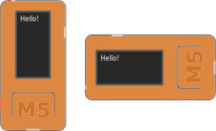

.. |MODE| image:: illustrationer/mubilleder/mode.jpg
   :height: 20
   :width: 20

.. |ESP| image:: illustrationer/mubilleder/esp.jpg
   :height: 20
   :width: 20

.. |RUN| image:: illustrationer/mubilleder/run.jpg
   :height: 20
   :width: 20

.. |NOTCONNECTED| image:: illustrationer/mubilleder/notconnected.jpg
   :height: 20
   :width: 20

Kom godt igang
==============

Der findes forskellige måder at programmere sin M5StickC på. I denne guide bruger vi Mu-editoren, så vi kan programmere med micropython.  

MU-editoren
-----------

Følg instrukserne og download MU editoren her: https://codewith.mu/en/download Det er vigtigt at downloade Alpha versionen for at kunne arbejde med M5StickC. 

Hvis du er Mac-bruger og ser en besked om, at programmet ikke kan åbnes, fordi det stammer fra en ukendt udvikler eller ikke blev hentet fra App Store, skal du gøre følgende:
	* Finde programmet i *Finder*. 
	* Holde *control* nede og klikke - eller højreklikke, hvis du har mus tilsluttet. 
	* Der dukker nu en menu frem og øverst kan du vælge *open*. 
	* Fremover vil programmet åbne, som alle andre programmer. 

Holdet bag Mu-editoren har en række tutorials, der kan gøre dig fortrolig med hvordan Mu fungere, de er på engelsk og du finder dem her : https://codewith.mu/en/tutorials/ - hvis du bare vil igang med M5stickC, så dækker denne guide.  

M5stickC
--------

Når Mu er downloaded og startet tilsluttes M5StickC til computerne via det medfølgende USBc kabel. MU skulle gerne selv finde M5StickC og du vil se følgende besked i bunden af vinduet: 

.. figure:: illustrationer/mubilleder/detectednew.jpg
   :alt: M5StickC tilsluttet Mu
   :width: 500px

Hvis du har dette symbol nederst i højre hjørne |NOTCONNECTED| er din M5StickC ikke tilsluttet. Prøv at genstarte MU. Hvis det ikke virker, så prøv at genstarte hele computeren. Stadig problemer? Prøv at tilslutte M5Stick til en anden USB port og genstart. Hvis du arbejder på Macbook, og ingen af dine USB porte ser ud til at virke, kan du prøve at resette SMC'en - følg denne guide https://macpaw.com/how-to/fix-usb-ports-on-mac. Hold M5Stick tilsluttet mens du resetter.  
  
Klik på Mode |MODE| og vælg ESP MicroPython |ESP| Du er nu klar til at skrive din første kode::   

   from m5stack import lcd
   lcd.clear(000000)
   lcd.text(10,10,"Hello World!")

Når du har skrevet ovenstående i MU så klik på Run |RUN| og du skulle nu kunne se noget skrift på skærmen.

