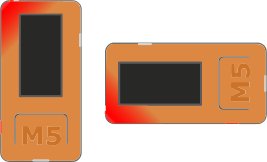

.. |ESP| image:: illustrationer/mubilleder/esp.jpg
   :height: 20
   :width: 20

.. |RUN| image:: illustrationer/mubilleder/run.jpg
   :height: 20
   :width: 20

.. |NOTCONNECTED| image:: illustrationer/mubilleder/notconnected.jpg
   :height: 20
   :width: 20

Kom godt igang
==============
Der findes forskellige måder at programmere sin M5StickC på. I denne
guide bruger vi Mu-editoren.

.. todo:: video der gennemgår samme trin som denne guide

Installation af Mu-editoren
---------------------------
Følg instrukserne og download Mu-editoren her:
https://codewith.mu/en/download Det er vigtigt at downloade Alpha
versionen for at kunne arbejde med M5StickC.

.. todo:: screenshot fra download siden, med pil mod de links man skal trykke på

Har du problemer med M5StickC på Mac? Læs :ref:`sektionen i bunden af
denne side <mu-on-mac-issues>`

M5StickC
--------

.. todo:: screenshot af Mu ved første gang den åbner - med "mode"
          vælgeren, der åbner automatisk første gang

Når Mu er downloaded og startet tilsluttes M5StickC til computerne via
det medfølgende USB-C kabel. Mu skulle gerne selv finde M5StickC og du
vil se følgende besked i bunden af vinduet:

.. figure:: illustrationer/mubilleder/detectednew.jpg
   :alt: M5StickC tilsluttet Mu
   :width: 500px

Hvis du har dette symbol nederst i højre hjørne |NOTCONNECTED| er din
M5StickC ikke tilsluttet. Prøv eventuelt at koble den til og fra,
eller bruge en anden USB-port. Hvis det stadig ikke virker, så læs
:ref:`fejlsøgningsguiden nedenfor <troubleshooting_guide>`.

Dit første program til M5StickC
^^^^^^^^^^^^^^^^^^^^^^^^^^^^^^^

.. todo:: er det ikke lidt sjovere at skrive "Hello world" på skærmen?
          (slet ikke denne sektion, men flyt til en anden side om
          LED'er, inkl. LED-strip?)

Klik på Mode |MODE| og vælg ESP MicroPython |ESP| Du er nu klar til at
skrive din første kode. Du placere cursoren der hvor der står ``# Write your code here :-)``
og skriver følgende::

   from m5stack import M5Led

   # Tænd for LED'en
   M5Led.on()

Hvis du starter en linje med ``#`` bliver det forstået som en kommentar til koden, og får ikke betydning for dit program. Når du har skrevet ovenstående i Mu så klik på Run |RUN| og du skulle nu kunne se den indbyggede LED lyse.

Sluk for led'en ved at ændre i koden så der står::

   from m5stack import M5Led

   # Sluk for LED'en
   M5Led.off()

og klik på Run |RUN|. 

Tillykke du er nu godt igang! 

Hvis du vil vide mere om Mu-editoren, så har holdet bag Mu-editoren
har en række tutorials, der kan gøre dig fortrolig med hvordan Mu
fungere, de er på engelsk og du finder dem her:
https://codewith.mu/en/tutorials/

.. _troubleshooting_guide:

Fejlsøgningsguide
-----------------

Der er nogle gange problemer med at få Mu og M5StickC til at snakke
sammen. Her er en oversigt over de mest almindelige problemer, og hvad
der måske kan løse det.

.. _mu-on-mac-issues:

Problemer med at åbne Mu på Mac?
^^^^^^^^^^^^^^^^^^^^^^^^^^^^^^^^
Hvis du er Mac-bruger og ser en besked om, at programmet ikke kan
åbnes, fordi det stammer fra en ukendt udvikler eller ikke blev hentet
fra App Store, skal du gøre følgende:

	* Finde programmet i *Finder*. 
	* Holde *control* nede og klikke - eller højreklikke, hvis du har mus tilsluttet. 
	* Der dukker nu en menu frem og øverst kan du vælge *open*. 
	* Fremover vil programmet åbne, som alle andre programmer. 

M5StickC bliver ikke opdaget af Mu (Windows)
^^^^^^^^^^^^^^^^^^^^^^^^^^^^^^^^^^^^^^^^^^^^

.. todo:: forklaring om driver installation tilføjes

M5StickC bliver ikke opdaget af Mu (Mac)
^^^^^^^^^^^^^^^^^^^^^^^^^^^^^^^^^^^^^^^^
          
Hvis du har dette symbol nederst i højre hjørne |NOTCONNECTED| er din
M5StickC ikke tilsluttet. Prøv at genstarte MU. Hvis det ikke virker,
så prøv at genstarte hele computeren. Stadig problemer? Prøv at
tilslutte M5Stick til en anden USB port og genstart. Hvis du arbejder
på Macbook, og ingen af dine USB porte ser ud til at virke, kan du
prøve at resette SMC'en - følg denne guide
https://macpaw.com/how-to/fix-usb-ports-on-mac. Hold M5Stick
tilsluttet mens du resetter.

