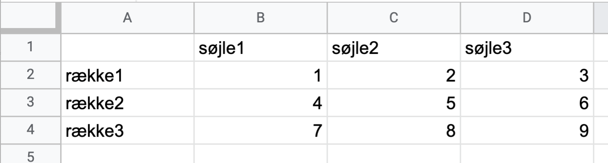

.. |RUN| image:: illustrationer/mubilleder/run.jpg
   :height: 20
   :width: 20

.. |FILES| image:: illustrationer/mubilleder/files.jpg
   :height: 20
   :width: 20

Gem og hent data
================

Gemme data
----------

.txt fil
^^^^^^^^

For at gemme data laves først en fil, ved at kalde funktionen :func:`open` og give to argumenter. 
Det første argument er det ønskede navn på filen, det næste er \'w\' fordi vi ønsker at kunne skrive i filen (w for write)::

	fil = open('data.txt', 'w')

Dernæst fortæller man hvad der ønsker skrevet i filen med funktionen :func:`fil.write`::
	
	fil.write('Her kan du skrive tekst - husk citationstegn!') 

Tilsidst lukkes filen med :func:`f.close`::
	
	fil.close()

.csv fil
^^^^^^^^

På tilsvarende måde kan man lave en .csv fil. CSV står for comma-seperated value. Med csvfiler kan man lave datafiler der egner sig til at bliver læst ind i en tabel i et regneark. Man bruger komma som skifter til næste søjle, mens \'\\n\' (newline) skifter til næste række::

	fil = open('data.csv', 'w')
	fil.write(',søjle1,søjle2,søjle3\n' +
         	  'række1,1,2,3\n' +
         	  'række2,4,5,6\n' +
        	  'række3,7,8,9\n')
	fil.close()

Ovenstående kode, vil give en fil der ser sådan her ud i et regneark (f.eks. Google sheets):
  

Man skal holde tungen lige i munden her - der er en masse tilfælde hvor denne metode vil give et dårligt resultat - pas på med mellemrum og vær især opmærksom på om dine tal bruger komma som decimalseparator - eller som tusindstalsseparator. Python har et indbygget bibliotek til at håndtere csv-filer, med det er desværre ikke med som standart på M5stickC. 
Man kan også importere en .txt fil til de fleste regneark, men hvis man ikke skal lave for meget manuel oprydning, er det en fordel at tænke i de baner som beskrevet herover. 

Fra M5stickC til computer
^^^^^^^^^^^^^^^^^^^^^^^^^
Med :func:`open`, :func:`fil.write` og :func:`fil.close` bliver dokumentet gemt lokalt på M5stick'en. For at få den over på computeren, kan man klikke på Files |FILES| i mu-editoren (husk at lukke REPL og Plotter) og trække den ønskede fil over til \"Files on your computer:\". Filen ligger nu samme sted som den mu-fil du arbejder i er gemt.  

.. image:: illustrationer/movefile.gif

Hente data
----------
For at brug noget data man har fra en anden kilde, skal man først overføre den pågældende data-fil til M5stickC'en. 

.. _comtilM5:

Fra computer til M5stickC
^^^^^^^^^^^^^^^^^^^^^^^^^

.. todo:: lave afsnittet om til at handle om .csv fil og andre datafiler. Lav ny illustration. 

For at overføre filer fra computeren til M5Stick, skal man klikke på Files |FILES| i mu-editoren (husk at lukke REPL og Plotter) og trække den ønskede fil over fra \"Files on your computer:\" over til \"Files on your devise:\". 

Det der plejer at drille her, er at den fil du gerne vil have over på M5StickC ikke ligger i listen med \"Files on your computer:\". 

MU åbner kun den mappe som det kode du er ved at skrive ligger gemt i - så du skal altså sikre dig at din kode og den fil du gerne vil overføre ligger gemt samme sted på computeren. 

Åben datafil
^^^^^^^^^^^^

Hvis man vil se indholdet af en fil der ligger på M5StickC, kan det gøres ved at åbne den i læsetilstand med :func:`open` og give \'r\' (r for read) som 2. argument. Dernæst kan funktionen :func:`fil.read` bruges, f.eks sammen med printfunktionen::

	fil = open('data.txt', 'r')
	print(fil.read())
	fil.close()

EKSEMPEL: Gemme IMU data i .csv format
--------------------------------------

For at få gemt målinger fra bevægelsessensoren kan følgende kode benyttes::

	import imu
	import time

	myIMU = imu.IMU()
	fil = open('imudata.csv', 'w')
	fil.write(';accelerometer_x;accelerometer_y;accelerometer_z;' +
          	'gyroskop_x;gyroskop_x;gyroskop_x\n')

	for i in range(10):	
		time.sleep_ms(600)
  	 	dataline = myIMU.acceleration + myIMU.gyro
  	  	print(dataline)
   	 	fil.write(str(i) + '; ')
  	  	for j in range(len(dataline)):
      	  		fil.write(str(dataline[j]) + '; ')
   	 	fil.write('\n')    
	fil.close() 

Nu kan man trække filen over til computeren og åbne den. 
Tjek at tallene er som de skal være - juster i Import Setting, hvis det ser forkert ud. 
Som delimiter/Value Separator skal semikolon bruges (fordi det er den vi bruger i koden) \';\'. 
Som Decimal Separator skal punktum \'.\' bruges. 
Der er basis for at kludre rigtig meget rundt i tallene - så se dig godt for.    

.. figure:: illustrationer/importsettings.png
   :alt: gyroskop, drejning x-, y-, z-aksen. 
   :width: 300px

EKSEMPEL: Hente data i .csv format
----------------------------------

.. todo:: skriv afsnit

