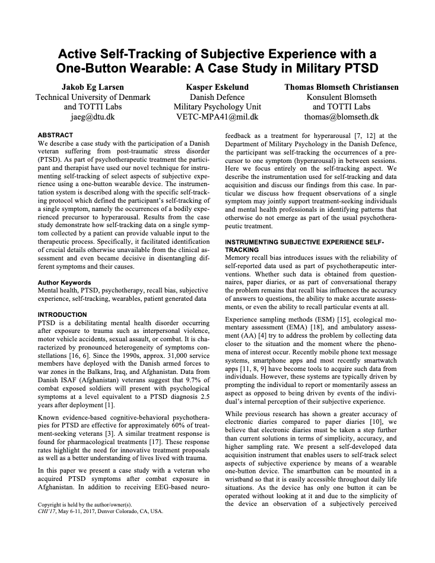

Tutorial: One Button Wearable til patienter med PTSD
====================================================

Patienter med posttraumatisk stress, f.eks. fra oplevelser ved krig,
kan få alvorlige traumer og nervesystemet kan have svært ved at falde
til ro. De kan bl.a. opleve anfald af *hyperarousal*. Det kan være
svært at forudsige hvornår anfaldene opstår, og om anfaldene har
sammenhæng med andet de foretager sig.

I denne tutorial viser vi hvordan man kan lave en simpel lille
wearable vedhjælp af M5StickC, som PTSD patienter kan bruge til at
registrere deres anfald. Idéen stammer fra artiklen "Active
Self-Tracking of Subjective Experience with a One-Button Wearable: A
Case Study in Military PTSD" af Larsen, Eskelund og Christiansen.
https://arxiv.org/abs/1703.03437

En sådan wearable kan også bruges til registrere andre begivenheder
(træthed, overspringshandlinger, negative tanker, stress-symptomer
osv.).

Vi forudsætter at du har installeret Mu editoren og er gået igennem
vores :doc:`komigang` guide.

Overordnet plan
---------------
Idéen med projektet er at patienten eller brugeren har et armbåndsur
med en enkelt knap, og hver gang de oplever symptomer på et anfald, så
klikker de på knappen.

Når de klikker på knappen, gemmes tidspunktet for knaptrykket i en
fil, som vi senere kan indlæse i fx Excel. For at gøre det har vi brug
for at kunne tre ting:

1. registrere knaptryk
2. registrere tidspunktet
3. skrive til en fil

Første skridt
-------------
For at komme i gang med at bruge knapperne og registrere tidspunkt,
skal du først se på disse to sider:

- :doc:`knapper`
- :doc:`tid`

Når du har fået arbejdet både med knappen, og hvordan man bruger det
indbyggede ur, så prøv at lave den følgende opgave, hvor du skal
kombinere hvad du har lært til ét samlet projekt.
  
**Opgave:** Gør så tidspunktet printes i konsollen, når man klikker på
knappen.

**NB:** Husk at gemme projektet, kald det fx ``onebuttonwearable.py``

Gemme hvert knaptryk i en fil
-----------------------------
Nu burde din wearable både kunne registrere knaptryk og
tidspunktet. Det næste skridt er så at skrive tidspunkterne til en
fil.

- Hvad er .csv?
- Eksempel på filformatet vi vil have ud af det

Overføre filen til computeren
-----------------------------
- Animation om overførsel i Mu

- Screenshot fra filen åben i .csv

Afprøvning
----------
Det er nok ikke alle der kender en med PTSD, der vil kunne afprøve din
wearable.

Prøv i stedet at registrere hver gang du kommer til at
overspringshandle, mens du burde lave noget fokuseret arbejde. Eller
prøv at registrere hver gang du åbner ``facebook.com`` eller en anden
hjemmeside du måske tjekker lidt for ofte.

Prøv at åbne .csv-filen i Excel, og se om du kan lave et plot over
tidspunkterne. Hvornår på dagen laver du flest overspringshandlinger?

Videre
------

 - Lær om hvordan man bruger skærmen via ... Gør fx så hver gang man
   trykker på knappen, så bliver der vist en grøn prik, eller andet
   som indikation af at knaptrykket blev registreret korrekt.

 - Lær om hvordan man kobler M5StickC på et WiFi-netværk og logger
   data til Airtable.com via guiden TODO. Log hvert knaptryk til en
   Airtable database. Bemærk: WiFi bruger meget strøm, så dit ur vil
   meget hurtigt løbe tør for strøm, hvis det er på batteri.

Hele koden til projektet
------------------------

.. code-block:: python

  from m5stack import btnA
  from m5stack import rtc
  import os

  # Sæt tidspunkt, læs evt. siden "Tid og dato", for at se hvordan
  # du finder tidspunktet via internettet
  rtc.setTime(2020, 10, 23, 15, 48, 52)

  filename = "timelog.csv"

  # Opret filen, hvis den ikke findes
  if filename not in os.listdir():
      print("File {} doesn't exist, creating.".format(filename))
      file = open("timelog.csv", "w")
      file.write("date;time\n")
      file.close()

  def knapAPressed():
    # Hvad er klokken?
    year, month, day, hour, minute, second = rtc.now()

    # Formater tidspunktet i et standard format
    timestring = "{:02d}:{:02d}:{:02d}".format(hour, minute, second)
    print(timestring)

    # Skriv tidspunktet til .csv filen
    file = open("timelog.csv", "a")
    file.write(timestring + "\n")
    file.close()

  btnA.wasPressed(knapAPressed)

..
   Disposition til denne side
   --------------------------

    - Registrer knaptryk

    - Gem tidspunkt i .csv-fil (eller Airtable) hver gang der trykkes

    - Vis hvordan .csv fil overføres til computeren

    - Evt. vis klokken på skærmen, så det også bare kan bruges som
      armbåndsur (se evt. skærmen, om der er andet interessant vi kan vise)

    - Evt. kan vi finde på nogle nogle opgaver? Så det ikke kun er
      "indtast efter os"...
