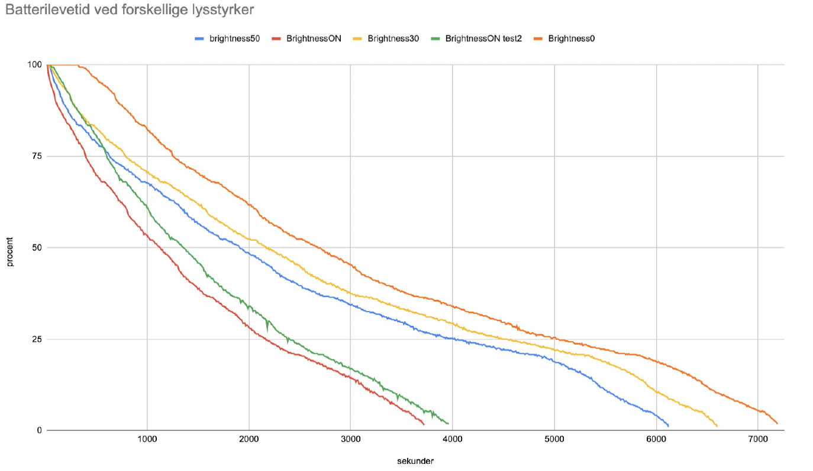

Strøm og batteri
================
M5StickC kommer med sit eget lille batteri (95mAH), der kan holde den
i live i et par timer. Hvis man har behov for at den skal holde
længere, kan man:

 - Tilslutte den til en powerbank via USB-C kablet
 - Tilslutte den til en almindelig USB-oplader i stikkontakten
 - prøve at optimere sit program, så det bruger mindre strøm. Se
   nogle tips nedenfor.

Tips til at spare strøm
-----------------------

Alt hvad du tilslutter til M5stickC tager strøm når det kører. Motorer, LED'er højtalerne og temperatursensor. Derfor er det en god ide at overveje nøje hvordan man skrive koden, så man f.eks kun aflæser en sensor når det er nødvendigt, og ikke har tænde LED hele tiden. 

Tilslutning til wifi sluger også strøm, så det er en god ide at logge på wifi, hente det data fra nettet man skal bruge og så logge af igen. 

Brug af skærmen er en stor strømsluger. Man kan skrue ned for skærmens lysniveau ``axp.setLcdBrightness(50)`` uden det betyder det store for aflæseligheden, og 

* Skru ned for skærmens lysniveau ``axp.setLcdBrightness(50)``
* Begræns brug af WiFi
* Brug ``machine.lightsleep()`` i stedet for ``time.sleep_ms()``
          

          
Tjek Batteriet
-------------------
Hvis I vil vise på skærmen om jeres M5StickC er ved at lade op, eller
måske vil du lave et program der deaktiverer nogle funktioner, hvis
den kører på batteri.

Husk som det første at importere axp-biblioteket: ``from m5stack import axp``

For at finde ud af om den kører på batteri, eller den er sluttet til
en anden strømkilde, kan I bruge funktionen ``axp.getChargeState()``

.. function:: axp.getChargeState()

   :rtype: boolean

Returnerer ``True`` hvis enheden er sluttet til strøm og oplader, ellers returneres ``False``.

Hvis du vil vide hvor meget spænding der er på batteriet kan du bruge ``axp.getBatVoltage()``. 

.. function:: axp.getBatVoltage()

   :rtype: float

Den giver dig spændingen i volt.

M5stickCs batteri har en max-spænding på omkring 4,187V og kan slet ikke tændes når spændingen er under 3,01V. 

Spændingen falder en del lige i starten, når M5stick tages ud af strømkilden og når spændingen når under 3,6V begynder den igen at falde dramatisk, og dette kan medføre at m5stick bliver ustabil. 

Regn med at din kode bliver kørt, så længe spændingen er cirka mellem 4,05V og 3,6V.

EKSEMPEL: Batteriets levetid i procent
----------------------------------------
::
	
	from m5stack import axp
	
	def map_value(value, input_min, input_max, aims_min, aims_max):
		value = min(max(input_min, value), input_max)
		value_deal = (value - input_min) * (aims_max - aims_min) / (input_max - input_min) + aims_min
		return round(value_deal, 2)
	
	while True:
		battery = map_value((axp.getBatVoltage()), 3.6,4.05,0,100)
		print(str(battery) + "%") 

Sluk M5StickC fra dit program
-----------------------------

Hvis du virkelig vil spare på strømmen bør du overveje at erstatte ``time.sleep_ms()`` med ``machine.lightsleep()``

.. function:: machine.lightsleep()

   Slukker din M5StickC i den angivne periode. Genoptager.

::

	import machine
	
	#lightsleep i 1000 ms
	machine.lightsleep(1000) 

Lightsleep husker hvilken tilstand maskine er i, så når den "vågner" kan den fortsætte fra det sted i koden den var nået til. 

Lightsleep er en virkeligt effektiv måde at forlænge batteriets levetid.

Der er også en mulighed at bruge ``machine.deepsleep()``:

.. function:: machine.deepsleep()

   Slukker din M5StickC i den angivne periode. Husker intet.

::

	import machine
	
	#deepsleep i 1000000 ms
	machine.deepsleep(1000000) 

Deepsleep slukke m5stick helt. Den gemme ikke tilstanden eller noget andet - det svarer til at bruge reset-knappen. Når m5stick vågner fra deepsleep køres programmet forfra. 

Deepsleep er nyttigt hvis du gerne vil have m5stick til at kører i ugevis, og f.eks kun måle noget hver anden time.
 
Deepsleep bruger en del strøm på at tænde og slukke, men til gengæld nærmest intet når den "sover". 

Man slukker sin M5StickC ved at holde tænd/sluk knappen nede i 6
sekunder. Hvis man vil slukke automatisk som del af sit program, kan
man kalde funktionen ``axp.powerOff()``

.. function:: axp.powerOff()

   Slukker din M5StickC.

