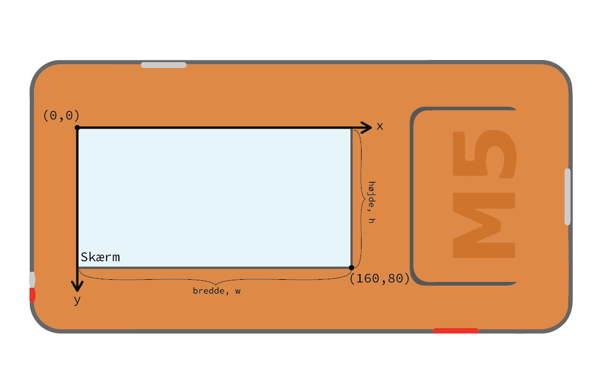

.. highlight:: python

Tegne på skærmen
================

.. original documentation: https://github.com/loboris/MicroPython_ESP32_psRAM_LoBo/wiki/display

I denne del af M5 Guide vil vi vise hvordan du kan tegne billeder,
figurer og tekst på skærmen på din M5StickC, samt hvordan du roterer
skærmen til landskabs-mode.

For at komme i gang, har du brug for at få adgang til skærmen via
``lcd`` objektet. Det gøres ved at importere det øverst i din Python-fil::

  from m5stack import lcd

Når det er gjort, er du klar til at tegne. For eksempepl kan du tegne
en firkant ved at kalde funktionen :func:`lcd.rect`::

  lcd.rect(10, 20, 40, 70)

De første to værdier, 10 og 20, angiver hvor rektanglet skal tegnes
som et `x`,`y`-koordinat. De næste to tal, 40 og 70, angiver hvor bred
og hvor høj firkanten skal være.

Koordinatsystem
---------------

For at kunne tegne på skærmen og angive hvor ting skal tegnes hende,
skal man forstå at koordinatsystemet i computere ikke er helt præcist
som i matematik-undervisningen (men tæt på).

På computerskærme bruger man den konvention at koordinatet ``(0, 0)``
er placeret i det øverste venstre hjørne af skærmen, og at når
y-værdien stiger, så flyttes koordinatet nedad, og ikke opad, som du
ellers kender det fra matematik.

De andre tegnefunktioner fungerer nogenlunde på samme vis, og nedenfor
kan du læse en beskrivelse for hver af dem om hvordan de virker.

Farveangivelse
--------------
Som standard vil alle tegnefunktionerne tegne figurer med et hvidt
omrids, men ellers gennemsigtige (ingen udfyldning). Farverne kan
ændres ved at angive et eller to ekstra farveargumenter til funktionerne.

Hvis vi for eksempel vil tegne firkanten med grøn farve som omrids, kan vi skrive::

  lcd.rect(10, 20, 40, 70, color=0x00FF00)

Hvis vi vil have grønt omrids og rød udfyldning, kan vi skrive::

  lcd.rect(10, 20, 40, 70, color=0x00FF00, fillcolor=0xFF0000)

Farveværdierne angives i hexadecimale tal. Dem kan man fx slå op i
tabeller online, eller ved at bruge farvevælger i et tegneprogram. De
fleste viser dog farverne som ``#00FF00`` (grøn), hvor man i Python vil
skrive det samme som ``0x00FF00``. `Læs mere om hexadecimale farveværdier
<https://www.finalsitesupport.com/hc/en-us/articles/115000768887-Hexadecimal-color-values>`_

Skærmretning
------------
En skærm kan vende på 4 forskellige måder, og alt afhængigt af hvordan
du har tænkt dig at bruge din M5StickC, kan det være forskelligt hvad
du gerne vil have til at være opad. Her er mulighederne:

Illustration: TODO

For at indstille hvilken vej der er opad, skal du bruge kommandoen
``lcd.orient``. Hvis du f.eks. vil lave et smart-watch med din
M5StickC, kan det være at *omvendt landskab* er det du har brug for,
og så skriver du::

  lcd.orient(lcd.LANDSCAPE_FLIP)

.. function:: lcd.orient(orientation)

   Ændrer skærmretningen og sletter alt på skærmen. Påvirker alle
   følgende tegnekommandoer.
              
   :param orientation: skal være én af:
   * ``lcd.PORTRAIT`` (standard): portræt
   * ``lcd.LANDSCAPE``: landskab
   * ``lcd.PORTRAIT_FLIP``: omvendt portræt
   * ``lcd.LANDSCAPE_FLIP``: omvendt landskab

   For eksempel, for at tegne på skærmen i landskabs-mode::

     lcd.orient(lcd.LANDSCAPE)

Skærmstørrelse
--------------
Skærmen på M5StickC er 160 pixels på den bredde led, og 80 pixels på
den smalle led.

Det er ofte bedre at spørge systemet selv om skærmstørrelsen, fremfor
at bruge tallene ``160`` og ``80`` som konstanter rundt i din
kode.

Funktionen ``lcd.screensize()`` kan fortælle dig skærmens størrelse.
Hvis du har indstillet skærmen i landskabs-mode, så vil den returnere
``(160, 80)``, mens i portræt-mode vil den returnere ``(80, 160)``.

.. function:: lcd.screensize()

   :rtype: `(int, int)`

   Returnerer skærmstørrelsen i pixels, for eksempel::

     (screen_width, screen_height) = lcd.screensize()

Tegne figurer
-------------
.. function:: lcd.clear()
              lcd.clear(color)

   Sletter alt på skærmen og farver den sort. Et valgfrit `color`
   argument kan bruges til at angive en anden farve.
   
   Hvis vi for eksempel vil farve skærmen gul, kan vi gøre det med
   følgende kald til :func:`lcd.clear`::

     lcd.clear(0xFFFF00)

.. function:: lcd.rect(x, y, height, width)
              lcd.rect(x, y, height, width, color)
              lcd.rect(x, y, height, width, color, fillcolor)

   Tegn et rektangel. Parametrene `x`, `y` angiver koordinatet for
   rektanglets øverste venstre hjørne. Parametrene `height` og
   `width` angiver størrelsen på rektanglet.

   Som standard tegnes kun et hvidt omrids af rektanglet.

   Et valgfrit `color` argument angiver farven på rektanglets
   omrids. Farven angives som en hexadecimal farveværdi (fx
   ``0xFF0000`` for rød, se ovenfor).

   Et andet valgfrit argument `fillcolor` angiver en udfyldningsfarve,
   som ligeledes angives som en hexadecimal farveværdi.

   For eksempel, hvis man vil tegne et rektangel med et rødt omrids og fyldt med blå farve::

     lcd.rect(10, 10, 40, 30, 0xFF0000, 0x0000FF)

   Hvis man vil tegne en firkant uden omrids, bør man sætte
   omridsfarve (`color`) og udfyldningsfarve (`fillcolor`) til at være
   samme farve.

   ..
      Draw a rectangle, starting with the top-right corner at the given
      `x` and `y` coordinates. The `height` and `width` parameters adjust
      the size of the rectangle.

      By default, only a white border around the rectangle is drawn.

      An optional `color` argument specifies the border color of the
      rectangle. The color is given as a hexadecimal value.

      A second optional `fillcolor` argument specifies that the rectangle
      should be filled in the given color. The fillcolor is given as a
      hexadecimal value.

      For example, to draw a rectangle with red border and filled with black::

        lcd.rect(10, 10, 40, 30, 0xFF0000, 0x000000)

   :param x: Talværdi: x-koordinat for rektanglet (øverste venstre hjørne)
   :param y: Talværdi: y-koordinat for rektanglet (øverste venstre hjørne)
   :param width: Talværdi: bredden af rektanglet
   :param height: Talværdi: højden af rektanglet
   :param color: Talværdi: farve på omrids (valgfri)
   :param fillcolor: Talværdi: udfyldningsfarve (valgfri)

.. function:: lcd.roundrect(x, y, height, width, r)
              lcd.roundrect(x, y, height, width, r, color)
              lcd.roundrect(x, y, height, width, r, color, fillcolor)

   Defaults to white border, no fill
              
.. function:: lcd.pixel(x, y)
              lcd.pixel(x, y, color)

   Defaults to white

.. function:: lcd.line(x1, y1, x2, y2)
              lcd.line(x1, y1, x2, y2, color)

   Defaults to white

.. function:: lcd.triangle(x1, y1, x2, y2, x3, y3)
              lcd.triangle(x1, y1, x2, y2, x3, y3, color)
              lcd.triangle(x1, y1, x2, y2, x3, y3, color, fillcolor)

   Defaults to white border, no fill.

.. function:: lcd.ellipse(x, y, width, height)
              lcd.ellipse(x, y, width, height, opt, color)
              lcd.ellipse(x, y, width, height, opt, color, fillcolor)

   Defaults to white border, no fill.

   If you want to choose color, always supply the number ``15`` as the
   `opt` parameter.

.. function:: lcd.circle(x, y, radius)
              lcd.circle(x, y, radius, color)
              lcd.circle(x, y, radius, color, fillcolor)

   Defaults to white border, no fill.

.. function:: lcd.arc(x, y, radius, thickness, start, end)
              lcd.arc(x, y, radius, thickness, start, end, color)
              lcd.arc(x, y, radius, thickness, start, end, color, fillcolor)

   Defaults to white border, no fill.

   :param x: Number: center x-coordinate
   :param y: Number: center y-coordinate
   :param radius: radius of arc
   :param thickness: Number: thickness of border
   :param start: Number: start angle in degrees (0°-360°)
   :param end: Number: end angle in degrees (0°-360°)

.. function:: lcd.polygon(x, y, radius, sides, thickness)
              lcd.polygon(x, y, radius, sides, thickness, color)
              lcd.polygon(x, y, radius, sides, thickness, color, fillcolor)
              lcd.polygon(x, y, radius, sides, thickness, color, fillcolor, rotate=0)

   Defaults to white border, no fill.

   The ``fillcolor`` argument to :func:`lcd.polygon` appears buggy, so you might experience
   some difficulty.

   :param x: Number: center x-coordinate
   :param y: Number: center y-coordinate
   :param radius: Number: radius of polygon
   :param radius: Number: number of sides of the polygon
   :param thickness: Number: thickness of border
   :param rotate: Number: angle to rotate in degrees (0°-360°)

.. function:: lcd.image(x, y, filename)

   :param x: Number: x-coordinate
   :param y: Number: y-coordinate
   :param filename: String: filename of image file, e.g. ``"img.bmp"``

   Supports ``.bmp`` and ``.jpg``
              

..
   **DONE:**
   ::
      lcd.clear(color=0x000000)
      lcd.text(x, y, 'hello world', color=0xffffff, transparent=True)
      lcd.print('hello world', x, y, color=0xffffff, transparent=True)
      lcd.rect(x, y, width, height, color=0xffffff, fillcolor=0xffffff)

   **TODO:**
   ::
      lcd.pixel(x, y, 0xffffff)
      lcd.line(x1, y1, x2, y2, 0xffffff)
      lcd.triangle(x1, y1, x2, y2, x3, y3, color=0xffffff, fillcolor=0xffffff)
      lcd.circle(x, y, radius, color=0xffffff, fillcolor=0xffffff)
      lcd.ellipse(x, y, rx, ry, color=0xffffff, fillcolor=0xffffff)
      lcd.arc(x, y, radius, thick, start, end, color=0xffffff, fillcolor=0xffffff)
      lcd.polygon(x, y, radius, sides, thick, color=0xffffff, fillcolor=0xffffff, rotate=10)

Tegne tekst på skærmen
----------------------
.. function:: lcd.text(x, y, msg)
              lcd.text(x, y, msg, color)
              lcd.text(x, y, msg, color, transparent=True)

   Display the string `msg` on the screen at the given coordinates `x`
   and `y`.

   The `color` of the text defaults to white, but can also be specified as
   third argument in hexadecimal (e.g ``0xFF0000`` for red,
   ``0x00FF00`` for green)

   The default behavior is to print the text on black background, if
   you want to disable this, and print on a transparent background add
   ``transparent=True`` as a keyword argument.

   To change which font is used, use the function :func:`lcd.font`.

   Aligning text in the center of the screen, can be done by replacing
   either `x` or `y`, or both, with the special value :const:`lcd.CENTER`

.. function:: lcd.setTextColor(0x000000, 0xffffff)
   
.. function:: lcd.font(font)

   ``lcd.font(lcd.FONT_Default)``

..
      ::

         Alternative fonts:
         - lcd.FONT_Default
         - lcd.FONT_DefaultSmall
         - lcd.FONT_DejaVu18
         - lcd.FONT_DejaVu24
         - lcd.FONT_DejaVu40
         - lcd.FONT_DejaVu56
         - lcd.FONT_DejaVu72
         - lcd.FONT_Ubuntu
         - lcd.FONT_Comic
