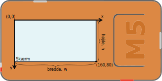
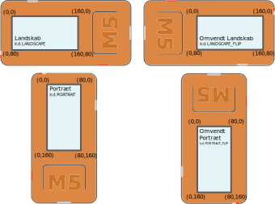

.. highlight:: python

Tegne på skærmen
================

.. original documentation: https://github.com/loboris/MicroPython_ESP32_psRAM_LoBo/wiki/display

I denne del af M5 Guide vil vi vise hvordan du kan tegne billeder,
figurer og tekst på skærmen på din M5StickC, samt hvordan du roterer
skærmen til landskabs-mode.

For at komme i gang, har du brug for at få adgang til skærmen via
``lcd`` objektet. Det gøres ved at importere det øverst i din Python-fil::

  from m5stack import lcd

Når det er gjort, er du klar til at tegne. For eksempel kan du tegne
en firkant ved at kalde funktionen :func:`lcd.rect`::

  lcd.rect(10, 20, 30, 50)

De første to værdier, 10 og 20, angiver hvor rektanglet skal tegnes
som et `x`,`y`-koordinat. De næste to tal, 30 og 50, angiver hvor bred
og hvor høj firkanten skal være.

Koordinatsystemet
-----------------

For at kunne tegne på skærmen og angive hvor ting skal tegnes hende,
skal man forstå at koordinatsystemet i computere ikke er helt præcist
som i matematik-undervisningen (men tæt på).

På computerskærme bruger man den konvention at koordinatet ``(0, 0)``
er placeret i det øverste venstre hjørne af skærmen, og at når
y-værdien stiger, så flyttes koordinatet nedad, og ikke opad, som du
ellers kender det fra matematik.

De andre tegnefunktioner fungerer nogenlunde på samme vis, og nedenfor
kan du læse en beskrivelse for hver af dem om hvordan de virker.

Farveangivelser
---------------
Som standard vil alle tegnefunktionerne tegne figurer med et hvidt
omrids, men ellers gennemsigtige (ingen udfyldning). Farverne kan
ændres ved at angive et eller to ekstra farveargumenter til funktionerne.

Hvis vi for eksempel vil tegne firkanten med grøn farve som omrids, kan vi skrive::

  lcd.rect(10, 20, 30, 50, color=0x00FF00)

Hvis vi vil have grønt omrids og rød udfyldning, kan vi skrive::

  lcd.rect(10, 20, 30, 50, color=0x00FF00, fillcolor=0xFF0000)

Farveværdierne angives i hexadecimale tal. Dem kan man fx slå op i
tabeller online, eller ved at bruge farvevælger i et tegneprogram. De
fleste viser dog farverne som ``#00FF00`` (grøn), hvor man i Python vil
skrive det samme som ``0x00FF00``. `Læs mere om hexadecimale farveværdier
<https://www.finalsitesupport.com/hc/en-us/articles/115000768887-Hexadecimal-color-values>`_

Skærmretning
------------
En skærm kan vende på 4 forskellige måder, og alt afhængigt af hvordan
du har tænkt dig at bruge din M5StickC, kan det være forskelligt hvad
du gerne vil have til at være opad. Her er mulighederne:

         omvendt landskab)
   :width: 500px

For at indstille hvilken vej der er opad, skal du bruge kommandoen
``lcd.orient``. Hvis du f.eks. vil lave et smart-watch med din
M5StickC, kan det være at *omvendt landskab* er det du har brug for,
og så skriver du::

  lcd.orient(lcd.LANDSCAPE_FLIP)

.. function:: lcd.orient(orientation)

   Ændrer skærmretningen og sletter alt på skærmen. Påvirker alle
   følgende tegnekommandoer.
              
   :param orientation: skal være én af:

   * ``lcd.PORTRAIT`` (standard): portræt
   * ``lcd.LANDSCAPE``: landskab
   * ``lcd.PORTRAIT_FLIP``: omvendt portræt
   * ``lcd.LANDSCAPE_FLIP``: omvendt landskab

   For eksempel, for at tegne på skærmen i landskabs-mode::

     lcd.orient(lcd.LANDSCAPE)

Skærmstørrelse
--------------
Skærmen på M5StickC er 160 pixels på den bredde led, og 80 pixels på
den smalle led.

Det er ofte bedre at spørge systemet selv om skærmstørrelsen, fremfor
at bruge tallene ``160`` og ``80`` som konstanter rundt i din
kode.

Funktionen ``lcd.screensize()`` kan fortælle dig skærmens størrelse.
Hvis du har indstillet skærmen i landskabs-mode, så vil den returnere
``(160, 80)``, mens i portræt-mode vil den returnere ``(80, 160)``.

.. function:: lcd.screensize()

   :rtype: `(int, int)`

   Returnerer skærmstørrelsen i pixels, for eksempel::

     screen_width, screen_height = lcd.screensize()

Tegn figurer på skærmen
-----------------------
.. function:: lcd.clear()
              lcd.clear(color)

   Sletter alt på skærmen og farver den sort.

   Eksempel::

     lcd.clear()

   TODO: illustration (før og efter billede)

   Farven kan angives ved at angive det valgfrie argument `color`.
   
   Eksempel, hvor vi farver skærmen gul::

     lcd.clear(0xFFFF00)

   TODO: illustration af M5StickC med helt gul skærm

   :param valgfri color: Talværdi: farve på omrids

.. function:: lcd.rect(x, y, height, width)
              lcd.rect(x, y, height, width, color)
              lcd.rect(x, y, height, width, color, fillcolor)

   Tegn et rektangel. `x`, `y` angiver koordinatet for rektanglets
   øverste venstre hjørne. `height` og `width` angiver størrelsen på
   rektanglet. Som standard tegnes kun et hvidt omrids af rektanglet.

   Eksempel::

     lcd.rect(10, 10, 40, 30)
   
   TODO: illustration med sort baggrund og hvidt rektangel

   Farver på omrids og udfyldning kan ændres med de to valgfrie
   argumenter `color` og `fillcolor`. Farverne angives som hexadecimal
   farveværdi (fx ``0xFF0000`` for rød, se ovenfor).

   Eksempel med rødt omrids::

     lcd.rect(10, 10, 40, 30, color=0xFF0000)

   Eksempel med rødt omrids og blå udfyldning::

     lcd.rect(10, 10, 40, 30, color=0xFF0000, fillcolor=0x0000FF)

   TODO: illustrationer af begge eksempler
     
   Hvis man vil tegne en firkant uden omrids, bør man sætte
   omridsfarve (`color`) og udfyldningsfarve (`fillcolor`) til at være
   samme farve.

   Eksempel på rødt rektangel::

     lcd.rect(10, 10, 40, 30, color=0xFF0000, fillcolor=0xFF0000) 

   :param x: Talværdi: x-koordinat for rektanglet (øverste venstre hjørne)
   :param y: Talværdi: y-koordinat for rektanglet (øverste venstre hjørne)
   :param width: Talværdi: bredden af rektanglet
   :param height: Talværdi: højden af rektanglet
   :param valgfri color: Talværdi: farve på omrids
   :param valgfri fillcolor: Talværdi: udfyldningsfarve

.. function:: lcd.roundrect(x, y, height, width, r)
              lcd.roundrect(x, y, height, width, r, color)
              lcd.roundrect(x, y, height, width, r, color, fillcolor)

   Tegn et rektangel med afrundede hjørner. `x`, `y` angiver koordinatet for rektanglets
   øverste venstre hjørne. `height` og `width` angiver størrelsen på
   rektanglet. `r` angiver radius på de afrundede hjørner.

   Hvis man for eksempel vil tegne et rektangel med let rundede
   hjørner, kan man angive en hjørneradius på 7 pixels::

     lcd.roundrect(10, 10, 30, 40, 7)

   TODO: illustration med let rundede hjørner
   
   Som standard tegnes kun et hvidt omrids af rektanglet. Farver på
   omrids og udfyldning kan ændres med de to valgfrie argumenter
   `color` og `fillcolor`. Det foregår på samme måde som for
   :func:`lcd.rect`.

   :param x: Talværdi: x-koordinat for rektanglet (øverste venstre hjørne)
   :param y: Talværdi: y-koordinat for rektanglet (øverste venstre hjørne)
   :param width: Talværdi: bredden af rektanglet
   :param height: Talværdi: højden af rektanglet
   :param r: Talværdi: radius på de afrundede hjørner
   :param valgfri color: Talværdi: farve på omrids
   :param valgfri fillcolor: Talværdi: udfyldningsfarve

.. function:: lcd.line(x1, y1, x2, y2)
              lcd.line(x1, y1, x2, y2, color)

   Tegn en linje fra koordinat `x1`, `y1` til koordinat `x2`, `y2`.

   Eksempel::

     lcd.line(10, 10, 50, 40)

   TODO: illustration, hvid linje på sort baggrund

   Farven kan ændres ved at angive argumentet `color`::

     lcd.line(10, 10, 50, 40, color=0x00FF00)

   TODO: illustration, grøn linje på sort baggrund

   :param x1: Talværdi: x-koordinat hvor linjen skal starte
   :param y1: Talværdi: y-koordinat hvor linjen skal starte
   :param x2: Talværdi: x-koordinat hvor linjen skal slutte
   :param y2: Talværdi: y-koordinat hvor linjen skal slutte
   :param valgfri color: Talværdi: farve på omrids

.. function:: lcd.triangle(x1, y1, x2, y2, x3, y3)
              lcd.triangle(x1, y1, x2, y2, x3, y3, color)
              lcd.triangle(x1, y1, x2, y2, x3, y3, color, fillcolor)

   Tegn en trekant ved at angive trekantens hjørner. `x1`, `y1`
   angiver det første hjørne, `x2`, `y2` det næste hjørne og `x3`,
   `y3` det sidste hjørne.

   Eksempel::

     lcd.triangle(10, 10, 50, 40, 10, 70)

   TODO: illustration, hvor også koordinaterne af de tre hjørner er tegnet ind

   Som standard tegnes kun et hvidt omrids af trekanten. Farver på
   omrids og udfyldning kan ændres med de to valgfrie argumenter
   `color` og `fillcolor`. Det foregår på samme måde som for
   :func:`lcd.rect`.

   Eksempel::

     lcd.triangle(10, 10, 50, 40, 10, 70, color=0xFF0000, fillcolor=0x0000FF)

   TODO: illustration af farvet rektangel

   :param x1: Talværdi: x-koordinat for trekantens første hjørne 
   :param y1: Talværdi: y-koordinat for trekantens første hjørne
   :param x2: Talværdi: x-koordinat for trekantens andet hjørne 
   :param y2: Talværdi: y-koordinat for trekantens andet hjørne
   :param x3: Talværdi: x-koordinat for trekantens tredje hjørne 
   :param y3: Talværdi: y-koordinat for trekantens tredje hjørne
   :param valgfri color: Talværdi: farve på omrids
   :param valgfri fillcolor: Talværdi: udfyldningsfarve
   
.. function:: lcd.ellipse(x, y, width, height)
              lcd.ellipse(x, y, width, height, opt, color)
              lcd.ellipse(x, y, width, height, opt, color, fillcolor)

   Tegn en ellipse. `x`, `y` angiver koordinatet for ellipsens
   centrum. `height` og `width` angiver størrelsen på rektanglet. Som
   standard tegnes kun et hvidt omrids af ellipsen.

   Eksempel::

     lcd.ellipse(40, 40, 20, 10)
   
   TODO: illustration med sort baggrund og hvid ellipse

   Som standard tegnes kun et hvidt omrids af rektanglet. Farver på
   omrids og udfyldning kan ændres med de to valgfrie argumenter
   `color` og `fillcolor`. Det foregår på samme måde som for
   :func:`lcd.rect`.

   Eksempel::

     lcd.ellipse(40, 40, 20, 10, color=0xFF0000, color=0x0000FF)

   TODO: illustration

   Parametret `opt` kan bruges til at kun tegne nogle dele af ellipsen
   ved at angive et tal mellem 0 og 15. Hvis det ikke angives, tegnes
   hele ellipsen.
   
   :param x: Talværdi: x-koordinat for centrum af ellipsen
   :param y: Talværdi: y-koordinat for centrum af ellipsen
   :param width: Talværdi: bredden af ellipsen
   :param height: Talværdi: højden af ellipsen
   :param valgfri opt: Talværdi: tal mellem 0-15, angiver hvilke dele af
               ellipsen der skal tegnes (15 = tegn hele ellipsen)
   :param valgfri color: Talværdi: farve på omrids
   :param valgfri fillcolor: Talværdi: udfyldningsfarve

.. function:: lcd.circle(x, y, radius)
              lcd.circle(x, y, radius, color)
              lcd.circle(x, y, radius, color, fillcolor)

   Tegn en cirkel. `x`, `y` angiver koordinatet for cirklens
   centrum. `radius` angiver cirklens radius. Som
   standard tegnes kun et hvidt omrids af cirklen.

   Eksempel::

     lcd.circle(40, 40, 10)

   TODO: illustration

   Som standard tegnes kun et hvidt omrids af cirklen. Farver på
   omrids og udfyldning kan ændres med de to valgfrie argumenter
   `color` og `fillcolor`. Det foregår på samme måde som for
   :func:`lcd.rect`.
   
   :param x: Talværdi: x-koordinat for centrum af cirklen
   :param y: Talværdi: y-koordinat for centrum af cirklen
   :param radius: Talværdi: cirklens radius
   :param valgfri color: Talværdi: farve på omrids
   :param valgfri fillcolor: Talværdi: udfyldningsfarve

.. function:: lcd.arc(x, y, radius, thickness, start, end)
              lcd.arc(x, y, radius, thickness, start, end, color)

   Tegn en cirkelbue. `x`, `y` angiver koordinatet for cirkelbuens
   centrum. `radius` angiver cirkelbuens radius. `thick` angiver
   tykkelsen af buen. `start` og `end` fortæller ved hvilke vinkler at
   buen skal starte og stoppe, og vinklerne angives i grader (0-360).

   Eksempel på cirkelbue der starter ved 0 grader og hen til 270 grader::

     lcd.arc(40, 40, 20, 1, 0, 270)

   TODO: illustration

   Som standard tegnes kun et hvidt omrids af cirklen, men farven kan
   ændres med det valgfrie argument `color`. Det foregår på samme måde
   som for :func:`lcd.rect`.

   :param x: Talværdi: x-koordinat for centrum af cirkelbuen
   :param y: Talværdi: y-koordinat for centrum af cirkelbuen
   :param radius: Talværdi: radius af cirkelbuen
   :param thickness: Talværdi: tykkelse af cirkelbuen
   :param start: Talværdi: startvinkel i grader (0-360)
   :param end: Talværdi: slutvinkel i grader (0-360)
   :param valgfri color: Talværdi: farve på omrids

.. function:: lcd.polygon(x, y, radius, sides, thickness)
              lcd.polygon(x, y, radius, sides, thickness, color)
              lcd.polygon(x, y, radius, sides, thickness, color, fillcolor)
              lcd.polygon(x, y, radius, sides, thickness, color, fillcolor, rotate)

   Tegner et regulært polygon på skærmen. Et regulært polygon er
   kendetegnet ved at alle sider er lige lange og alle vinkler er lige
   store.

   `x`, `y` angiver koordinatet for centrum af polygonet. `radius`
   angiver afstanden fra centrum til hjørnerne. `sides` angiver
   hvor mange sider polygonen skal have (trekant, firkant, femkant, sekskant, osv.)

   Eksempel på en sekskant med radius på 10 pixels::

     lcd.polygon(40, 40, 10, 6)

   TODO: illustration
   
   Argumentet `thick` kan bruges til at ændre tykkelsen af
   omridset. For eksempel kan vi tegne en femkant med 3 pixel omrids::

     lcd.polygon(40, 40, 15, 5, thick=2)

   TODO: illustration

   Argumentet `rotate` kan bruges til at rotere polygonen et vist
   antal grader (0-360).
     
   Argumentet ``fillcolor`` til :func:`lcd.polygon` virker til at være
   fejlbehæftet, så du kommer nok til at opleve problemer hvis du
   forsøger.

   :param x: Number: center x-coordinate
   :param y: Number: center y-coordinate
   :param radius: Number: radius of polygon
   :param radius: Number: number of sides of the polygon
   :param thickness: Number: thickness of border
   :param rotate: Number: angle to rotate in degrees (0°-360°)

.. function:: lcd.pixel(x, y)
              lcd.pixel(x, y, color)

   Tænd en enkelt pixel. `x`, `y` angiver hvilken pixel der
   skal tændes.

   Som standard farves den angivne pixel hvid, det valgfrie
   farveargument gør det muligt at ændre det til en vilkårlig anden
   farve.

   Tænd en pixel i gul farve::

     lcd.pixel(40, 40, 0xFFFF00)

   .. kommentar: til en pixel behøves nok ikke en illustration

Tegn JPG og BMP billeder på skærmen
-----------------------------------

.. function:: lcd.image(x, y, filename)

   Indlæser en billedfil med navnet `filename`, som er placeret på
   M5StickC'ens filsystem. Understøtter kun ``.bmp`` og ``.jpg`` filer.

   TODO: link til guide hvor man kan se hvordan man overfører filer
              
   :param x: Talværdi: x-koordinat hvor billedet skal tegnes
   :param y: Talværdi: y-koordinat hvor billedet skal tegnes
   :param filename: Tekststreng: filnavn på billedfilen, f.eks. ``"img.bmp"`` eller ``"photo.jpg"``

Tegne tekst på skærmen
----------------------
.. function:: lcd.text(x, y, msg)
              lcd.text(x, y, msg, color)
              lcd.text(x, y, msg, color, transparent=True)

   Vis teksten `msg` på skærmen, ved det angivne koordinat `x`, `y`.

   Eksempel::

     lcd.text(10, 10, "Hello!")

   TODO: illustration
     
   Som standard bruges hvid tekstfarve, men det kan ændres via
   argumentet `color`::

     lcd.text(10, 10, "Hello!", color=0xFF0000)

   TODO: illustration

   Som standard tegnes også en sort baggrund, som teksten tegnes
   på. Hvis du vil slå denne sorte baggrund fra, og gøre baggrunden
   gennemsigtig, kan du angive ``transparent=True`` som argument::

     lcd.text(10, 10, "Hello!", color=0xFF0000, transparent=True)

   Hvis du vil bruge en anden skrifttype, så se funktionen :func:`lcd.font`.

   Hvis du vil centrere teksten på skærmen, kan vi erstatte enten `x`
   eller `y`, eller begge, med den specielle værdi ``lcd.CENTER``.

.. function:: lcd.font(font)

   Indstiller hvilken skrifttype der skal bruges, når man bruger
   kommandoen :func:`lcd.text`.

   Eksempel::

     lcd.font(lcd.FONT_DejaVu24)
     lcd.text(5, 5, "Hello!")

   TODO: illustration

   :param font: skal være én af følgende indbyggede værdier:

   * ``lcd.FONT_Default`` (standard)
   * ``lcd.FONT_DefaultSmall``
   * ``lcd.FONT_DejaVu18``
   * ``lcd.FONT_DejaVu24``
   * ``lcd.FONT_DejaVu40``
   * ``lcd.FONT_DejaVu56``
   * ``lcd.FONT_DejaVu72``
   * ``lcd.FONT_Ubuntu``
   * ``lcd.FONT_Comic``

..
  .. function:: lcd.setTextColor(0x000000, 0xffffff)
   

..
   **DONE:**
   ::
      lcd.clear(color=0x000000)
      lcd.text(x, y, 'hello world', color=0xffffff, transparent=True)
      lcd.print('hello world', x, y, color=0xffffff, transparent=True)
      lcd.rect(x, y, width, height, color=0xffffff, fillcolor=0xffffff)
      lcd.pixel(x, y, 0xffffff)
      lcd.line(x1, y1, x2, y2, 0xffffff)
      lcd.triangle(x1, y1, x2, y2, x3, y3, color=0xffffff, fillcolor=0xffffff)
      lcd.circle(x, y, radius, color=0xffffff, fillcolor=0xffffff)
      lcd.ellipse(x, y, rx, ry, color=0xffffff, fillcolor=0xffffff)
      lcd.arc(x, y, radius, thick, start, end, color=0xffffff, fillcolor=0xffffff)
      lcd.polygon(x, y, radius, sides, thick, color=0xffffff, fillcolor=0xffffff, rotate=10)

