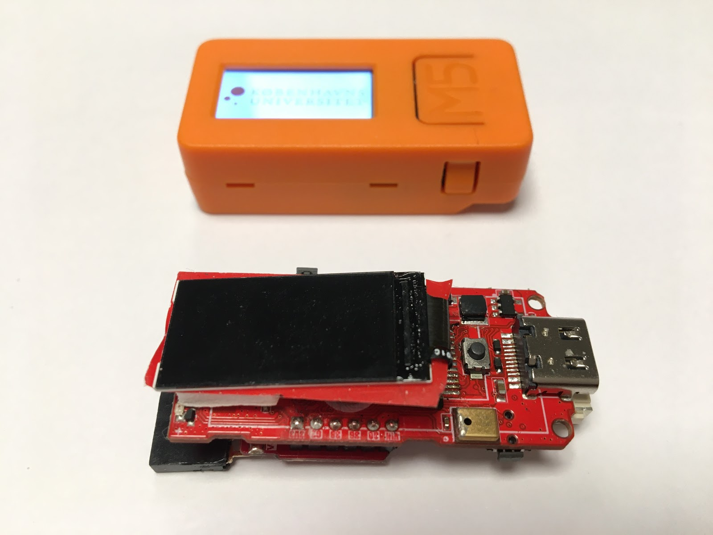

.. |RUN| image:: illustrationer/mubilleder/run.jpg
   :height: 20
   :width: 20

Hvad kan man med en M5StickC?
=============================

..
   Disposition
   -----------
    - Vis foto af M5StickC skilt ad, så man kan se hvordan den ser ud
      indvendigt
    - Eksempler på hvad man kan lave af projekter med de forskellige sensorer
    - Eksempler på hvad man kan, hvis man bruger en af
      netværksforbindelserne (WiFi, ESPNOW, bluetooth)
    - Eksempler på hvad man kan med andet eksternt udstyr sensorer/aktuatorer
    - Tabel med tekniske specifikationer nederst i filen

Overblik over M5StickC
----------------------

..
   .. todo:: illustration
    - foto af M5StickC skilt ad, så man kan se hvordan den ser ud indvendigt

   .. todo:: illustration
    - foto af hele M5StickC

   Begge fotos med labels og pile der angiver komponenternes placering

M5stickC er baseret på en microcontroller af typen ESP32. 

Som standard har M5StickC følgende features:

   * Bevægelsessensor - se hvordan den bruges her :doc:`accelerometer_gyro`
   * Infrarød sender
   * Mikrofon
   * Batteri - se beskrivelse her: :doc:`stroem`
   * To programmerbare knapper (Knap A og Knap B) (se :ref:`knaptryk`)
   * Tænd/sluk knap
   * En indbygget LED (se :ref:`indbygget_led`)

M5StickC forbindes til computeren via det medfølgende USB-C kabel.

Hvad kan hvis man tilslutter eksternt udstyr?
---------------------------------------------

.. todo:: Eksempler på hvad man kan, hvis man tilslutter ekstra
    sensorer eller aktuatorer

..
   Eksempler på hvad man kan, hvis man tilslutter højtaler,
   fugtighedssensor, muskelsensor, motor, kamera (UnitV)

    - eksempler på projekter, gerne med korte videoer

Netværksforbindelse
-------------------

.. todo:: Eksempler på projekter der forbinder til internettet, eller
           bruger bluetooth eller ESPNOW
..
   Eksempler på hvad man kan, hvis man bruger WiFi, ESPNOW eller bluetooth.

    - Logge data til internettet, gerne illustration af en graf, der
      viser noget data logget over tid

    - Hente data fra hjemmesider, fx hvornår går næste bus? Hvordan er
      vejret? Hvor meget CO2 udledes lige nu? Hvor meget er blevet lånt
      på biblioteket i dag? 

Tekniske specifikationer
------------------------

.. Evt. omform til tabel, eller bare referer til hjemmesiden
   https://m5stack.com/collections/m5-core/products/stick-c

**Microprocessor:**
 - ESP32 microprocesser (240 Mhz, 320 KB RAM, 4MB flash memory)
 - WiFi 802.11 b/g/n
 - Bluetooth
 - Real Time Clock

**Input/output muligheder:**
 - 6-akset bevægelsessensor (3 akset accelerometer, 3 akset gyroskop)
 - Rød LED lampe (tænd/sluk)
 - 3 knapper, hvor 2 er programmerbare, 1 er til tænd/sluk
 - Infrarød transmitter
 - Mikrofon
 - 0.96" farveskærm (160x80 pixels)

**Strøm og tilslutninger:**
 - Indbygget genopladeligt batteri (95 mAH, 3.7 volt)
 - 1 x USB-C
 - 1 x Grove port
 - Direkte adgang til pins G0, G26, G36
   
**Størrelse og vægt:**
 - 15.1 gram
 - 48.2mm x 25.5mm x 13.7mm
