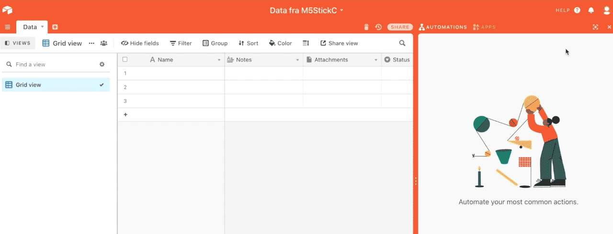

Forbindelse til internettet
===========================

Denne del af guiden forklarer hvordan du logger på WiFi, henter data
fra internettet, og logger data til en online database på Airtable.com

Logge på WiFi
-------------
For at forbinde M5StickC til et WiFi netværk, skal man importere
modulet ``wifiCfg``::

  import wifiCfg

Derefter kan I forbinde til et wifi hotspot ved at angive dets navn og
password::

  wifiCfg.doConnect("MitWifiNet", "WifiPassword")

ESP32, den microcontroller som M5StickC er baseret på understøtter
ikke 5Ghz netværk, og det er heller ikke muligt at logge på
"Enterprise" netværk, som dem der bruges i store firmaer eller på
universiteter. Det virker dog fint på almindelige WiFi som dem vi har
hjemme i vores private hjem, eller ved at oprette et hotspot fra sin
mobiltelefon.

.. function:: wifiCfg.doConnect(essid, password)

   Forbind til wifi-netværket med navnet `essid` og passwordet `password`.

   :param essid: Tekststreng: navnet på det WiFi-hotspot du vil forbinde til (fx ``"dlink-2,4GHz"``)
   :param password: Tekststreng: passwordet til WiFi netværket

.. function:: wifiCfg.isconnected()

   Returnerer ``True`` hvis M5StickC er forbundet til et WiFi hotspot.
   Returnerer ``False`` hvis den ikke er forbundet.

   :rtype: `bool`

Hente data fra internettet
--------------------------

Lad os prøve at hente noget data fra internettet. Hjemmesiden
https://exchangeratesapi.io/ kan fx fortælle os de nuværende
vekselkurser mellem forskellige valutaer.

Vi kan hente data fra internettet ved at kalde :func:`urequests.get` fra
biblioteket ``urequests``. Lad os prøve, ved at hente nuværende
vekselkurser mellem Euro og en række andre valutaer via hjemmesiden
https://api.exchangeratesapi.io/latest.

Først importerer vi ``urequests``::

  import urequests

Derefter kan vi hente indholdet af siden ved at kalde :func:`urequests.get`::

  response = urequests.get("https://api.exchangeratesapi.io/latest")

Det giver os et såkaldt *Response objekt*. Med responseobjektet kan vi
få indholdet af siden ud:

>>> response.text
'{"rates":{"CAD":1.5563,"HKD":9.1885,"ISK":164.9,"PHP":57.388,"DKK":7.4407,"HUF":364.17,"CZK":27.222,"AUD":1.6578,"RON":4.874,"SEK":10.3618,"IDR":17410.24,"INR":87.3245,"BRL":6.6052,"RUB":90.6421,"HRK":7.5778,"JPY":124.17,"THB":37.056,"CHF":1.0715,"SGD":1.6089,"PLN":4.5823,"BGN":1.9558,"TRY":9.4418,"CNY":7.9157,"NOK":10.9178,"NZD":1.7703,"ZAR":19.1905,"USD":1.1856,"MXN":24.753,"ILS":4.0032,"GBP":0.90675,"KRW":1338.52,"MYR":4.9291},"base":"EUR","date":"2020-10-23"}'

Ovenstående er den rå tekst hjemmesiden består af, men ovenstående er
egentlig skrevet i et format der hedder JSON. Hvis vi prøver selv at
indsætte nogle linje skift og mellemrum, bliver strukturen mere
tydelig::

  {
    "rates": {
      "CAD": 1.5563,
      "HKD": 9.1885,
      "ISK": 164.9,
      "PHP": 57.388,
      "DKK": 7.4407,
      "HUF": 364.17,
      "CZK": 27.222,
      "AUD": 1.6578,
      "RON": 4.874,
      "SEK": 10.3618,
      "IDR": 17410.24,
      "INR": 87.3245,
      "BRL": 6.6052,
      "RUB": 90.6421,
      "HRK": 7.5778,
      "JPY": 124.17,
      "THB": 37.056,
      "CHF": 1.0715,
      "SGD": 1.6089,
      "PLN": 4.5823,
      "BGN": 1.9558,
      "TRY": 9.4418,
      "CNY": 7.9157,
      "NOK": 10.9178,
      "NZD": 1.7703,
      "ZAR": 19.1905,
      "USD": 1.1856,
      "MXN": 24.753,
      "ILS": 4.0032,
      "GBP": 0.90675,
      "KRW": 1338.52,
      "MYR": 4.9291
    },
    "base": "EUR",
    "date": "2020-10-23"
  }

Python kan aflæse JSON, så det bliver nemmere at trække en enkelt værdi ud.

Det gøres ved at bruge ``response.json()`` funktionen, der returnerer
en såkaldt `dictionary`, man kan slå op i:
  
>>> data = response.json()
>>> rates = data["rates"]
>>> rates["DKK"]
7.4407

.. function:: urequests.get(url)
              urequests.get(url, headers)

   :rtype: `Response` object

.. function:: urequests.post(url)
              urequests.post(url, data, headers)
              urequests.post(url, data, headers)

   :rtype: `Response` object

Logge data til en database på Airtable.com
------------------------------------------

Opret en gratis konto på airtable.com |SIGNUP| Følg instruktionerne og færdiggør opstarten ved at klikke op **Create workspace**  |CREATE|. Tilføj en ny base. Navngiv den og klik dig ind på den. 

For at kunne sende og modtage data fra din nye database, har du brug for tre informationer.
* Din unikke api Key
* Din bases ID
* Navnet på dit *table*

Find api key
^^^^^^^^^^^^
Øverst til højre er et lille profil-ikon, klik på det og vælg **account** du får nu adgang til en side hvor din personlige api-nøgle kan findes. Klik **generate API key** Marker og kopier nøglen og sæt den ind i din kode. 

Find din bases ID
^^^^^^^^^^^^^^^^^

Klik på **Help** øverst til højre og vælg <> API dokumentation. Under Introduction finder du den base ID du har brug for.

Find navnet på dit *table*
^^^^^^^^^^^^^^^^^^^^^^^^^^

Navnet på dit første *table* er som udgangspunkt Table 1 - for at kunne linke til et navn der indeholde mellemrum skrives %20. Navnet på dit *table* er altså, med mindre du har ændret det, Table%201. 

Post data på airtable
^^^^^^^^^^^^^^^^^^^^^

Først skal vi importere de biblioteker vi skal bruge::

	import wifiCfg
	import urequests
	import json

Dernæst skal vi bruge API key, baseID og tableName for at sammensætte et link til database og en header der giver os tilladelse til at skrive i databasen.::
 
	apiKey = "Din Unikke API key"
	baseID = "Din bases ID"
	tableName = "Table%201" #husk at ændet navnet på dit table her, hvis du har omdøbt det.

	apiURL = "https://api.airtable.com/v0/" + baseID + "/" + tableName
	headers = {'Authorization': 'Bearer ' + apiKey, 'Content-Type': 'application/json'}

Så skal der bare forbindes til wifi og postes data på airtable. Der er massere af hjælp at hente på **<> API dokumentation**, hvis det er svært at finde ud af strukturen i det data man genre vil sende.::

	wifiCfg.doConnect("MitWifiNet", "WifiPassword")

	if wifiCfg.isconnected():
    
        	mes = {"fields":{
            		"Name": "En note om Airtable",
            		"Notes": "Airtable kan meget",
                		}
            		}
        	jsondata = json.dumps(mes)
        	urequests.post(apiURL, headers=headers, data=jsondata)
 

